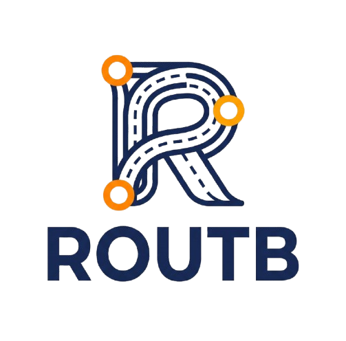

  

# 1. Introducción y objetivos

ROUTB es una plataforma diseñada para facilitar y gestionar el transporte compartido entre los estudiantes de la Universidad Tecnológica de Bolívar. El sistema busca centralizar la información relacionada con estudiantes conductores, rutas disponibles y cupos libres, permitiendo a los estudiantes consultar las opciones de transporte y reservar un cupo antes del viaje.

La plataforma surge como respuesta a las dificultades que presentan algunos estudiantes para encontrar y coordinar transporte hacia o desde la universidad, especialmente debido a la falta de información sobre conductores disponibles, cupos y horarios de salida.

## 1.1 Objetivo general

Desarrollar una plataforma que permita gestionar y coordinar el transporte compartido entre estudiantes de la Universidad Tecnológica de Bolívar.

## 1.2 Funcionalidades principales
- Consultar conductores disponibles.
- Mostrar las rutas de transporte disponibles.
- Visualizar la cantidad de cupos libres.
- Permitir la reserva de un cupo antes del viaje.
- Reducir los tiempos de espera de los estudiantes.
- Mejorar la organización y coordinación de los viajes compartidos.

## 1.3 Descripción general de los requisitos

ROUTB es una plataforma de movilidad colaborativa dirigida a estudiantes universitarios. El sistema permite a los estudiantes conductores publicar recorridos indicando su origen, destino, horario y cantidad de cupos disponibles, mientras que los estudiantes pasajeros pueden buscar recorridos según sus necesidades y solicitar uno o varios cupos.

Entre las principales funcionalidades del sistema se encuentran la gestión de perfiles, publicación y administración de recorridos, búsqueda y gestión de solicitudes y cupos, ubicación de recogida o destino predeterminado, visualización mediante mapas, notificaciones, historial de recorridos y sistema de valoración.

El sistema también contempla un panel administrativo destinado a la gestión de usuarios, reportes, estadísticas e incidencias.

## 1.4 Objetivos de calidad

| Prioridad | Objetivo de calidad | Descripción                                                                                                                      | Interesado |
| --------- | ------------------- | -------------------------------------------------------------------------------------------------------------------------------- | ---------- |
| 1         | **Rendimiento**     | Las búsquedas deben responder en menos de 2 segundos bajo condiciones normales.                                                  | Estudiantes (principalmente pasajeros) |
| 2         | **Seguridad**       | Las contraseñas deben almacenarse mediante hashing con salt y las comunicaciones deben utilizar HTTPS.                           | Estudiantes (conductores y pasajeros) |
| 3         | **Disponibilidad**  | El sistema debe alcanzar una disponibilidad mínima del 99 % durante las franjas de mayor demanda.                                | Estudiantes (usuarios activos) |
| 4         | **Escalabilidad**   | La arquitectura debe permitir el crecimiento del número de usuarios y recorridos sin degradar significativamente el rendimiento. | Equipo de desarrollo |
| 5         | **Portabilidad**    | La aplicación debe funcionar de manera equivalente en Android e iOS.                                                             | Estudiantes (usuarios móviles) |
| 6         | **Mantenibilidad**  | El sistema debe utilizar una arquitectura modular y documentada que facilite su evolución.                                       | Equipo de desarrollo |
| 7         | **Privacidad**      | Los datos personales deben tratarse de acuerdo con la Ley 1581 de 2012 y las políticas de protección de datos aplicables.        | Universidad / comunidad universitaria |
| 8         | **Usabilidad**      | Las acciones principales deben poder realizarse en un máximo de tres pasos.                                                      | Estudiantes (pasajeros) |

## 1.5 Stakeholders / Interesados

| Stakeholder                               | Interés / expectativa                                                                                           |
| ----------------------------------------- | --------------------------------------------------------------------------------------------------------------- |
| **Estudiante conductor**                  | Publicar recorridos, gestionar cupos y solicitudes y coordinar los puntos de recogida de los pasajeros.         |
| **Estudiante pasajero**                   | Encontrar recorridos compatibles, solicitar cupos, conocer el estado de sus solicitudes y gestionar sus viajes. |
| **Administrador**                         | Gestionar usuarios, reportes, estadísticas e incidencias y supervisar el funcionamiento de la plataforma.       |
| **Equipo de desarrollo**                  | Mantener una arquitectura modular, mantenible y documentada que permita evolucionar el sistema.                 |
