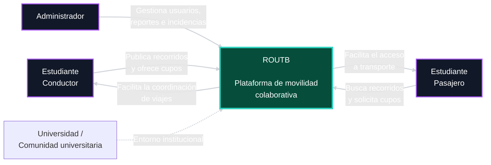
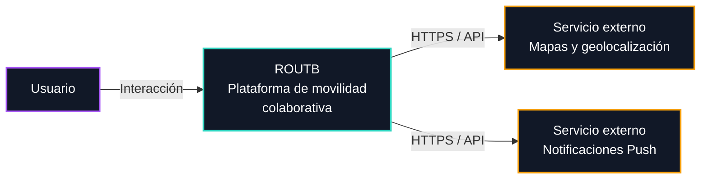

# 3. Contexto y alcance

ROUTB es una plataforma de movilidad colaborativa dirigida a estudiantes universitarios. El sistema permite a estudiantes conductores publicar recorridos y gestionar los cupos disponibles, mientras que los estudiantes pasajeros pueden consultar recorridos, solicitar uno o varios cupos y gestionar sus viajes. Los administradores utilizan la plataforma para supervisar usuarios, reportes, estadísticas e incidencias.

## 3.1 Contexto empresarial

Representa la relación entre la plataforma y los principales actores involucrados en la movilidad colaborativa universitaria.

| Interfaz                                  | Relación con ROUTB                                                            |
| ----------------------------------------- | ----------------------------------------------------------------------------- |
| **Estudiante conductor**                  | Ofrece recorridos, administra cupos y gestiona solicitudes.                   |
| **Estudiante pasajero**                   | Consulta recorridos, solicita cupos y gestiona sus viajes.                    |
| **Administrador**                         | Supervisa usuarios, reportes, estadísticas e incidencias.                     |

## 3.2 Contexto tecnico

Representa los principales sistemas y canales mediante los cuales ROUTB recibe, procesa, almacena e intercambia información.

| Interfaz                          | Canal            | Propósito                                                                        |
| --------------------------------- | ---------------- | -------------------------------------------------------------------------------- |
| **Usuario ↔ ROUTB**               | Interfaz cliente | Registro, autenticación, consulta y gestión de recorridos, solicitudes y viajes. |
| **ROUTB ↔ Servicio de mapas**     | HTTPS / API      | Consulta de mapas, ubicaciones y geolocalización.                                |
| **ROUTB ↔ Notificaciones Push**   | HTTPS / API      | Envío de notificaciones relacionadas con recorridos y solicitudes.               |

| Entrada / Salida                 | Origen / Destino          | Canal                       |
| -------------------------------- | ------------------------- | --------------------------- |
| Credenciales y datos de registro | Usuario → ROUTB           | HTTPS / REST                |
| Solicitudes de recorridos        | Usuario → ROUTB           | HTTPS / REST                |
| Información de recorridos        | ROUTB → Usuario           | HTTPS / REST                |
| Gestión de cupos y solicitudes   | Usuario ↔ ROUTB           | HTTPS / REST                |
| Ubicaciones                      | Usuario ↔ ROUTB           | HTTPS / REST + API de mapas |
| Datos de mapas                   | Servicio de mapas → ROUTB | HTTPS / API                 |
| Datos persistentes               | ROUTB ↔ Persistencia        | SQL                         |
| Notificaciones                   | ROUTB → Usuario           | Servicio Push               |
