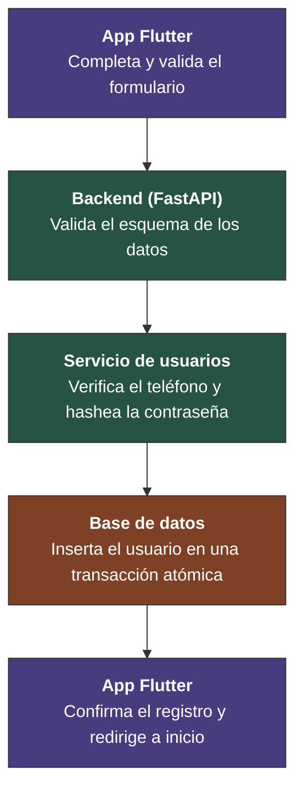
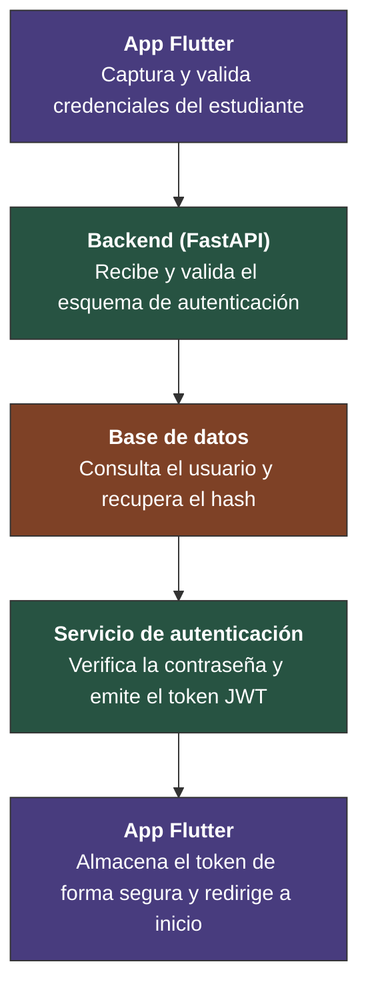
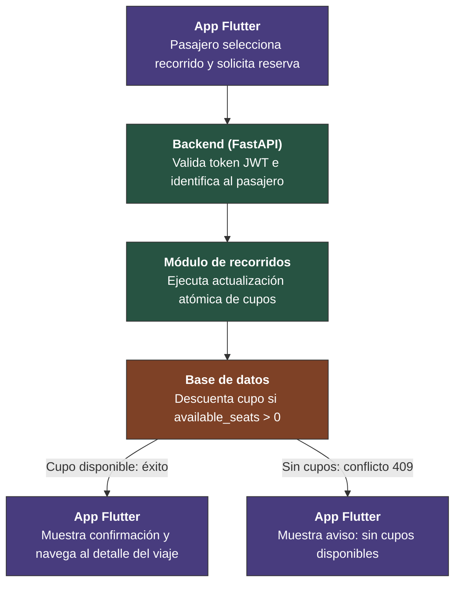

# 6. Vista de ejecución

## 6.1 Escenario de Runtime 1 — Registro de Usuario

Capa de Presentación (Cliente Flutter): el estudiante completa el formulario de registro y la interfaz valida localmente los datos (formato, campos obligatorios, longitud mínima de contraseña) antes de habilitar el envío.

Capa de Red: los datos ya validados se serializan y se transmiten al backend a través de una conexión cifrada, protegiendo la información en tránsito.

Capa de API / Enrutamiento (FastAPI): el backend valida la estructura y el tipo de los datos recibidos contra un esquema estricto, rechazando cualquier solicitud que no cumpla el contrato antes de continuar.

Capa de Servicio (lógica de negocio): se verifica que el teléfono no esté registrado previamente y la contraseña se hashea de forma segura, de modo que el valor original nunca se almacena.

Capa de Persistencia (PostgreSQL / Supabase): el nuevo usuario se inserta en la base de datos dentro de una transacción atómica, garantizando consistencia ante fallos.

Cierre del flujo: el backend confirma la creación del usuario y el cliente redirige al estudiante hacia la pantalla principal, impidiendo el regreso al formulario ya completado.

### Diagrama de secuencia

### Aspectos relevantes

Validación en capas: el cliente filtra errores obvios y el backend impone el contrato final, por lo que ningún dato corrupto llega a persistirse aunque falle la validación del lado del cliente.

Seguridad de credenciales: la contraseña viaja cifrada y se persiste únicamente como hash (bcrypt), nunca en texto plano.

Consistencia transaccional: la inserción en base de datos es atómica, evitando registros parciales si algo falla a mitad de camino.

Experiencia de usuario: la navegación final reemplaza la pantalla de registro en la pila de navegación, evitando que el estudiante repita el proceso por accidente.

## 6.2 Escenario de Runtime 2 — Inicio de Sesión

Capa de Presentación (Cliente Flutter): el estudiante ingresa su número de teléfono y contraseña en la pantalla de inicio de sesión, y la interfaz valida localmente que los campos no se encuentren vacíos y tengan un formato válido antes de procesar el acceso.

Capa de Red: las credenciales ingresadas se empaquetan de forma segura y se transmiten al backend a través de un canal de comunicación cifrado.

Capa de API / Enrutamiento (FastAPI): el backend intercepta la solicitud de acceso y valida la integridad de los datos recibidos contra el esquema de autenticación definido.

Capa de Persistencia (PostgreSQL / Supabase): el sistema consulta la base de datos para recuperar el registro del usuario asociado al número de teléfono y obtener su hash de seguridad.

Capa de Servicio (lógica de negocio): se compara y verifica criptográficamente la contraseña ingresada contra el hash almacenado; una vez confirmada la identidad, el servicio genera y firma digitalmente un token de acceso seguro (JWT) con un tiempo de expiración determinado.

Cierre del flujo: el cliente móvil recibe el token de acceso, lo almacena de forma segura en el dispositivo para autorizar futuras peticiones a la plataforma y redirige al estudiante hacia la pantalla principal, bloqueando el retorno a la vista de inicio de sesión.

### Diagrama de secuencia

### Aspectos relevantes

Arquitectura sin estado (Stateless): el backend no mantiene sesiones activas en memoria ni en base de datos; la identidad y los permisos del estudiante quedan respaldados por la firma digital del token JWT.

Aislamiento de la lógica de autenticación: el módulo de autenticación centraliza la verificación de credenciales y la emisión de tokens, evitando que otros módulos del sistema manejen directamente contraseñas o algoritmos de firma.

Persistencia segura en el cliente: el token se resguarda en el almacenamiento seguro local del dispositivo móvil para adjuntarse como autorización en las solicitudes a módulos como viajes o solicitudes.

Protección en la navegación: al igual que en el registro, la redirección a la pantalla principal reemplaza la vista de inicio de sesión en el historial del dispositivo para evitar accesos redundantes.

---

## 6.3 Escenario de Runtime 3 — Reserva de cupo en un recorrido

Capa de Presentación (Cliente Flutter): el estudiante pasajero selecciona un recorrido disponible y pulsa el botón de reserva. La interfaz verifica que el usuario tenga sesión activa y que el recorrido muestre al menos un cupo disponible antes de enviar la solicitud.

Capa de Red: la solicitud de reserva se transmite al backend con el token JWT del pasajero adjunto en la cabecera de autorización, a través de una conexión cifrada.

Capa de API / Enrutamiento (FastAPI): el backend valida el token, identifica al pasajero y enruta la solicitud al módulo de recorridos, que ejecuta la lógica de reserva.

Capa de Persistencia (PostgreSQL): la reserva se realiza mediante una actualización atómica condicionada a que `available_seats > 0`. Solo la transacción que logra actualizar el contador consume un cupo; las demás reciben un error de conflicto. Esto evita la sobreventa incluso cuando varios pasajeros intentan reservar el mismo cupo al mismo tiempo.

Cierre del flujo: si la reserva fue exitosa, el backend responde con confirmación y el cliente navega a la pantalla de confirmación del viaje. Si no hay cupos disponibles, el backend responde con un error de conflicto y el cliente muestra un aviso al pasajero.

### Diagrama de secuencia

### Aspectos relevantes

Atomicidad de la reserva: la actualización del contador de cupos y la creación de la reserva ocurren en una sola operación de base de datos. No es posible que dos pasajeros concurrentes obtengan el mismo cupo.

Respuesta inmediata: el pasajero recibe confirmación o rechazo en la misma conexión HTTP, sin necesidad de consultar el estado posteriormente. Esta decisión se documenta en el [ADR 0004](../adr/0004-integracion-sincrona-rest.md).

Protección frente a concurrencia: la prueba `backend/tests/test_cupos.py` valida este escenario con 20 intentos simultáneos sobre 4 cupos, confirmando exactamente 4 reservas exitosas y cero cupos negativos.

Autorización por rol: solo los usuarios con sesión activa y token válido pueden realizar reservas. El módulo de autenticación verifica el token antes de que la solicitud llegue al módulo de recorridos.

---
