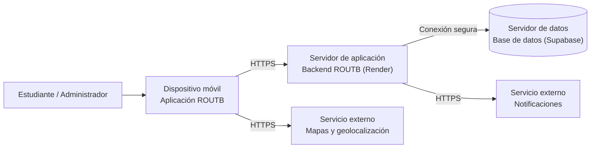
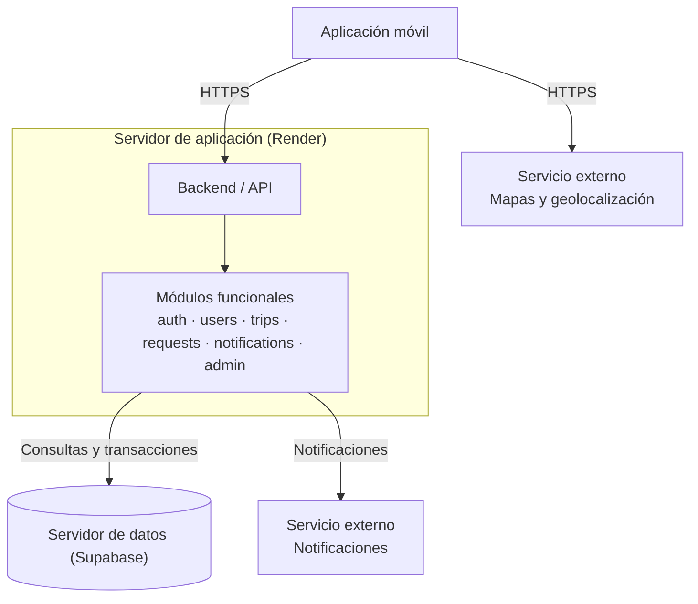

# 7. Vista de despliegue

## 7.1 Infraestructura — Nivel 1

**Diagrama general:**

**Motivación:**

ROUTB se despliega como una aplicación móvil que consume un backend centralizado.
El backend concentra los módulos funcionales, consulta la información persistida
y se comunica con el servicio externo de notificaciones, mientras que el dispositivo
móvil se comunica directamente con el servicio externo de mapas y geolocalización.
Esta distribución mantiene el despliegue sencillo y adecuado para el alcance del proyecto,
operando bajo proveedores en la nube sin costo (Render para el backend y Supabase para la base de datos).

**Características de calidad y/o rendimiento:**

- La comunicación entre la aplicación móvil y el backend se realiza mediante
  un canal seguro (HTTPS).
- La información de usuarios, recorridos, solicitudes y cupos se mantiene en
  un almacenamiento centralizado en Supabase.
- El backend en Render ejecuta el contenedor de la aplicación y puede responder
  a las solicitudes públicas del sistema.
- Las integraciones externas se mantienen separadas del núcleo de ROUTB.
- La disponibilidad del sistema depende del servicio en Render, la base de datos
  en Supabase y los servicios externos utilizados.

**Mapeo de Building Blocks a Infraestructura (Dónde se ejecuta cada pieza):**

| Building block (Pieza del sistema) | Nodo de infraestructura | Proveedor y dónde se ejecuta |
|---|---|---|
| Aplicación móvil | Dispositivo móvil del usuario | Dispositivo Android / iOS |
| Backend / API | Servidor de aplicación | Render (Web Service contenerizado en la nube) |
| Base de datos relacional | Servidor de datos | Supabase (Instancia gestionada de PostgreSQL en la nube) |
| Mapas y geolocalización | Servicio externo de mapas | Infraestructura del proveedor externo de mapas |
| Notificaciones | Servicio externo de notificaciones | Infraestructura del proveedor externo de notificaciones |

## 7.2 Infraestructura — Nivel 2

### Elemento de infraestructura 1 — Servidor de aplicación (Render)

**Diagrama:**

**Explicación:**

El servidor de aplicación se ejecuta como un servicio web en la nube de **Render**, a partir del contenedor Docker definido en `backend/Dockerfile`. Dentro de este nodo se alojan los módulos funcionales de la aplicación. Los módulos procesan las solicitudes, aplican las reglas del sistema, consultan la base de datos en Supabase y utilizan las integraciones externas cuando una funcionalidad lo requiere.

Este nodo no almacena permanentemente la información del sistema. Su responsabilidad es procesar las peticiones y coordinar la comunicación con la base de datos y el servicio externo de notificaciones.

### Elemento de infraestructura 2 — Servidor de datos (Supabase)

**Explicación:**

El servidor de datos se ejecuta como una base de datos PostgreSQL gestionada en la nube de **Supabase**. Es el nodo encargado de la persistencia permanente de los datos del sistema (usuarios, credenciales con hash, viajes y registro de solicitudes). Mantiene el control atómico de cupos mediante transacciones SQL y recibe conexiones seguras exclusivamente desde el backend en Render y el entorno de pruebas.
