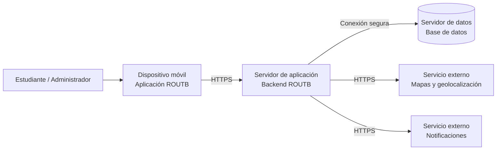
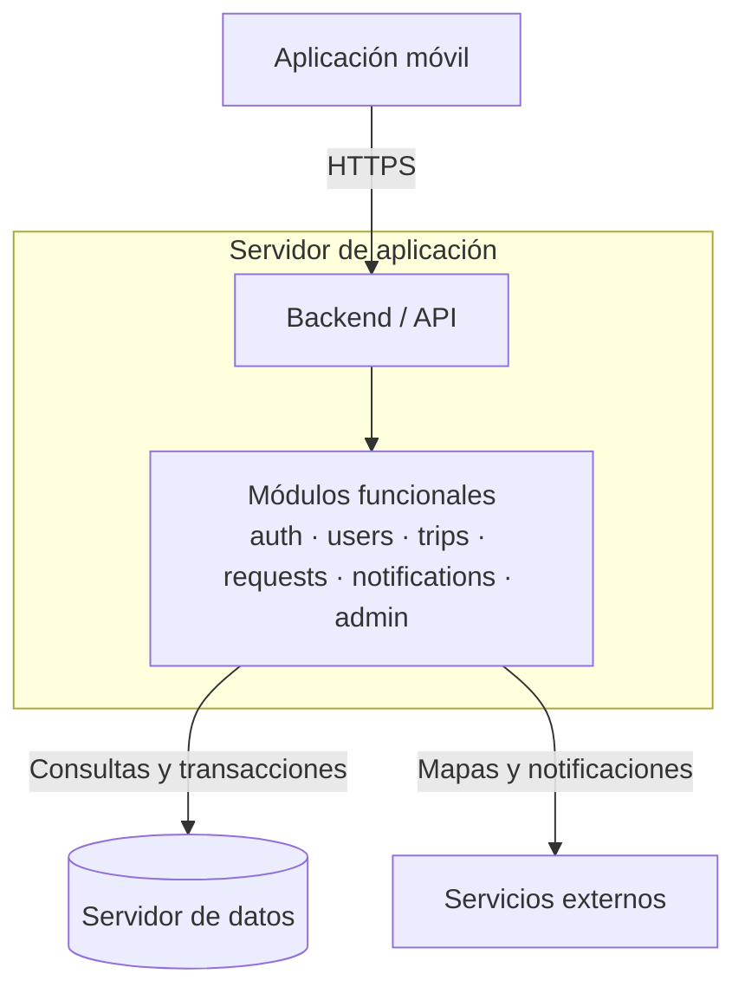

# 7. Vista de despliegue

## 7.1 Infraestructura — Nivel 1

**Diagrama general:**

**Motivación:**

ROUTB se despliega como una aplicación móvil que consume un backend centralizado.
El backend concentra los módulos funcionales, consulta la información persistida
y se comunica con los servicios externos de mapas, geolocalización y
notificaciones. Esta distribución mantiene el despliegue sencillo y adecuado
para el alcance del proyecto.

**Características de calidad y/o rendimiento:**

- La comunicación entre la aplicación móvil y el backend se realiza mediante
  un canal seguro.
- La información de usuarios, recorridos, solicitudes y cupos se mantiene en
  un almacenamiento centralizado.
- El backend puede aumentar su capacidad si crece el número de usuarios.
- Las integraciones externas se mantienen separadas del núcleo de ROUTB.
- La disponibilidad del sistema depende principalmente del servidor de
  aplicación, el servidor de datos y los servicios externos utilizados.

**Mapeo de Building Blocks a Infraestructura:**

| Building block | Nodo de infraestructura |
|---|---|
| Aplicación móvil | Dispositivo móvil del usuario |
| Backend / API | Servidor de aplicación |
| Base de datos | Servidor de datos |
| Mapas y geolocalización | Servicio externo de mapas |
| Notificaciones | Servicio externo de notificaciones |

## 7.2 Infraestructura — Nivel 2

### Elemento de infraestructura 1 — Servidor de aplicación

**Diagrama:**

**Explicación:**

El servidor de aplicación ejecuta el backend de ROUTB y expone la API utilizada
por la aplicación móvil. Dentro de este nodo se alojan los módulos funcionales
del monolito modular. Los módulos procesan las solicitudes, aplican las reglas
del sistema, consultan el servidor de datos y utilizan las integraciones
externas cuando una funcionalidad lo requiere.

Este nodo no almacena permanentemente la información del sistema. Su
responsabilidad es procesar las peticiones y coordinar la comunicación con el
servidor de datos y los servicios externos.

---
