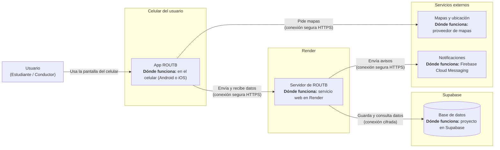
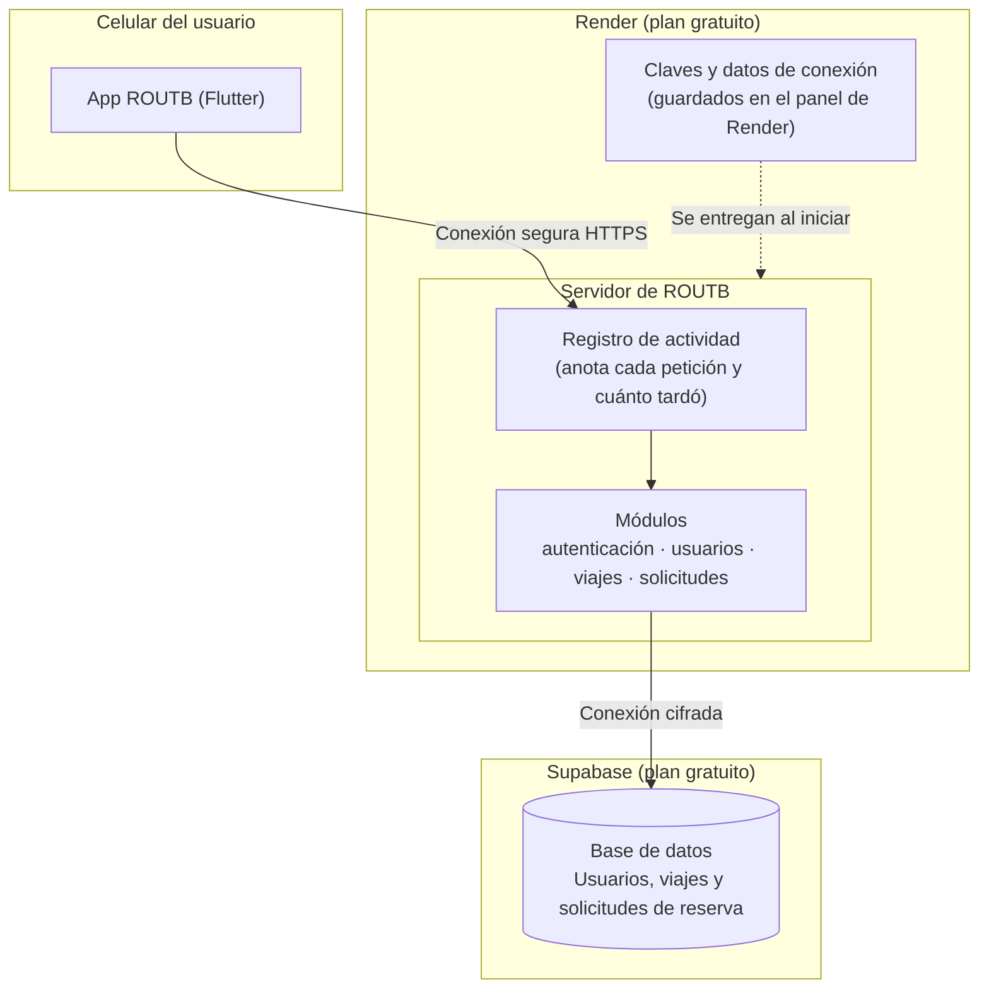

# 7. Vista de despliegue
 
Esta vista muestra dónde funciona cada parte de ROUTB: en el celular del usuario, en el servidor que ejecuta la aplicación y en el servicio que guarda los datos. También explica por qué se eligió cada plataforma, con enlaces a las decisiones de arquitectura (ADR). Todo el sistema funciona sin costo mensual ($0.00 USD) y sin tarjetas bancarias.
 
---
 
## 7.1 Infraestructura - Nivel 1
 
El siguiente diagrama presenta cada pieza del sistema, dónde se ejecuta y cómo se comunica con las demás:
 

 
### Por qué está organizado así
 
ROUTB funciona como un sistema con tres partes que se reparten el trabajo: la app del celular, el servidor y la base de datos.
 
1. **Cada parte hace lo suyo.** El servidor concentra las reglas del negocio y el control de cupos. Los datos se guardan aparte, en un servicio administrado en internet.
2. **Sin costo.** Cada plataforma se usa en su plan gratuito y no pide tarjeta bancaria: Render ejecuta el servidor y Supabase guarda los datos.
3. **Comunicación protegida.** Todo lo que viaja por internet va cifrado.
### Qué pieza corre dónde
 
| Pieza | Dónde funciona | Plataforma | Cómo se comunica | Decisión asociada |
|---|---|---|---|---|
| **App ROUTB** | En el celular del estudiante | App Flutter (Android / iOS) | Conexión segura con el servidor y con los mapas | [ADR 0004 - Integración síncrona REST](../adr/0004-integracion-sincrona-rest.md) |
| **Servidor de ROUTB** | Servicio web en la nube | **Render** | Recibe las peticiones de la app por una dirección web segura | [ADR 0005 - Despliegue en Render](../adr/0005-render-plataforma-de-despliegue.md) |
| **Base de datos** | Servicio de base de datos administrado | **Supabase** | Conexión cifrada con el servidor | [ADR 0006 - Base de datos en Supabase](../adr/0006-base-de-datos-supabase.md) |
| **Mapas y ubicación** | Servidores del proveedor de mapas | Proveedor externo (OpenStreetMap / Google) | Conexión segura desde la app | Servicio externo |
| **Notificaciones** | Plataforma de mensajería de Google | Firebase Cloud Messaging | Conexión segura desde el servidor | Servicio externo |
 
---
 
## 7.2 Infraestructura - Nivel 2
 
El siguiente diagrama muestra con más detalle qué hay dentro de cada plataforma:
 

 
### 7.2.1 App ROUTB (celular)
- **Dónde funciona:** en el celular (Android o iOS) del estudiante o conductor.
- **Qué hace:** muestra las pantallas (inicio de sesión, búsqueda de viajes, solicitud de cupos), toma la ubicación del dispositivo y pide la información al servidor.
- **Con quién habla:** con el servidor, en `https://as-202620-routb.onrender.com`.
- **Decisión asociada:** [ADR 0004 - Integración síncrona REST](../adr/0004-integracion-sincrona-rest.md).
### 7.2.2 Servidor de ROUTB (Render)
- **Dónde funciona:** como un servicio web en **Render**, en su plan gratuito. La aplicación va empacada en un contenedor (Docker) y se configura con archivos guardados en el repositorio ([configuración de Render](../../render.yaml)).
- **Seguridad:** el servidor se ejecuta con permisos limitados, solo los necesarios para funcionar.
- **Claves y contraseñas:** se guardan en el panel de Render y nunca en el repositorio (ver [Sección 8.3](08_conceptos_transversales.md#83-gestión-de-secretos-y-configuración)).
- **Registro de actividad:** anota cada petición recibida y cuánto tardó en responder. Render conserva esos registros (ver [Sección 8.4](08_conceptos_transversales.md#84-observabilidad-y-logging-estructurado)).
- **Decisión asociada:** [ADR 0005 - Elección de plataforma para el despliegue del backend (Render)](../adr/0005-render-plataforma-de-despliegue.md).
### 7.2.3 Base de datos (Supabase)
- **Dónde funciona:** como un proyecto de base de datos administrado en **Supabase**, en su plan gratuito.
- **Qué guarda:** de forma permanente los usuarios, los viajes y las solicitudes de reserva.
- **Cómo se conecta:** el servidor se comunica con ella por una conexión cifrada, y un intermediario de la plataforma reutiliza las conexiones para no saturarla.
- **Cambios en la estructura:** se hacen mediante migraciones versionadas en el repositorio, de modo que cada cambio queda registrado.
- **Decisión asociada:** [ADR 0006 - Elección de plataforma para la base de datos (Supabase)](../adr/0006-base-de-datos-supabase.md).
### 7.2.4 Servicios externos (mapas y notificaciones)
- **Mapas y ubicación:** los usa la app directamente, por conexión segura, para mostrar mapas y rutas.
- **Notificaciones:** las envía el servidor para avisar a pasajeros y conductores sobre el estado de sus reservas.
---
 
## 7.3 Limitaciones de los planes gratuitos
 
Al usar planes gratuitos, cada plataforma tiene un comportamiento que conviene conocer:
 
| Pieza | Qué pasa | Qué efecto tiene | Dónde está documentado |
|---|---|---|---|
| **Servidor (Render)** | Se "duerme" si pasan 15 minutos sin recibir visitas | La primera petición después de ese tiempo puede tardar entre 30 y 50 segundos. Las siguientes responden con normalidad | [ADR 0005](../adr/0005-render-plataforma-de-despliegue.md) |
| **Servidor (Render)** | Incluye 750 horas de uso al mes | Un solo servicio puede funcionar todo el mes sin agotarlas | [ADR 0005](../adr/0005-render-plataforma-de-despliegue.md) |
| **Base de datos (Supabase)** | Se pausa si pasan 7 días sin uso | Se reactiva desde el panel de Supabase, sin perder datos ni cambiar su estructura | [ADR 0006](../adr/0006-base-de-datos-supabase.md) |
 
### Cómo se verifica
 
- **Que el servicio está activo:** [Verificación de despliegue externo](../evidencia/despliegue-externo.md).
- **Que responde con rapidez:** la medición del tiempo de respuesta de la búsqueda de viajes está en [Métrica de calidad consultable](../evidencia/metricas-escenario-calidad.md). Esa medición no incluye el arranque tras el "sueño" del servidor, porque ocurre antes de que el registro de actividad empiece a contar.
- **Que no genera costo:** [Costo mensual](../evidencia/costo_mensual.md).
