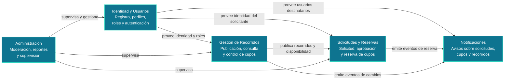

# 8. Conceptos transversales

Los conceptos transversales son decisiones y mecanismos que afectan a varios
módulos y funcionalidades de ROUTB. Se describen de forma independiente de la
implementación concreta para mantener una visión arquitectónica común.

## 8.1 Lenguaje ubicuo técnico

Esta sección define los términos técnicos que deben entender de la misma forma
las personas que trabajan en el proyecto.

| Concepto técnico | Qué significa en ROUTB | Dónde se refleja |
|---|---|---|
| Backend | Aplicación que contiene las reglas del negocio y expone la funcionalidad de ROUTB. | FastAPI en `backend/app/`. |
| Frontend | Aplicación con la que interactúan los estudiantes y administradores. | Flutter en `frontend/lib/`. |
| API | Punto de comunicación entre frontend y backend. | Endpoints FastAPI que reciben y devuelven JSON. |
| Módulo | Unidad funcional dentro del backend monolítico. | `users`, `auth`, `trips`, `requests`, `notifications` y `admin`. |
| Capa | Tipo de responsabilidad dentro de un módulo. | `router` expone la API, `service` aplica reglas, `models` representa datos y `schemas` valida mensajes. |
| Autenticación | Verificación de la identidad antes de permitir una operación protegida. | `/auth/login`, JWT y `get_current_user`. |
| Autorización | Decisión sobre qué operaciones puede ejecutar una identidad autenticada. | Roles del usuario y dependencias de seguridad del backend. |
| Token JWT | Credencial firmada que el backend entrega después del inicio de sesión. | Backend genera el token; Flutter conserva `routb_access_token` en `SharedPreferences`. |
| Persistencia | Conservación de los datos aunque la API o la aplicación se reinicien. | PostgreSQL en Supabase, SQLAlchemy y los modelos ORM. |
| ORM | Mapeo entre clases del código y tablas de la base de datos. | `User` → `users` y `Trip` → `trips`. |
| Migración | Cambio versionado del esquema de la base de datos. | Alembic en `backend/migrations/`. |
| Transacción atómica | Operación que se confirma completa o se revierte completa. | Reserva de cupo mediante actualización condicionada en `trips`. |
| Integración externa | Comunicación con un sistema que no pertenece al código de ROUTB. | Servicios de mapas y notificaciones push. |
| Contrato de error | Formato y significado de las respuestas cuando una operación falla. | Códigos HTTP, `detail` de FastAPI y `AuthApiException` en Flutter. |

## 8.2 Mapa de contextos funcionales

ROUTB se organiza en contextos funcionales dentro de un único backend
modular. Un contexto agrupa una responsabilidad del negocio y define los
términos y reglas que le corresponden. Estos contextos no son servicios
desplegables independientes.

| Contexto | Responsabilidad | Relación principal |
|---|---|---|
| Identidad y Usuarios | Registrar usuarios, mantener perfiles, roles y autenticación. | Provee identidad y permisos a los demás contextos. |
| Gestión de Recorridos | Publicar recorridos y mantener la disponibilidad de cupos. | Expone recorridos y disponibilidad a Solicitudes y Reservas. |
| Solicitudes y Reservas | Gestionar solicitudes y confirmar reservas sin sobrepasar los cupos. | Consume recorridos y emite eventos de reserva. |
| Notificaciones | Informar solicitudes, reservas, cambios y disponibilidad. | Recibe eventos de Recorridos y Solicitudes y los entrega a los usuarios. |
| Administración | Supervisar usuarios, recorridos y solicitudes, además de gestionar reportes. | Consulta y gestiona los demás contextos según permisos administrativos. |

En el código actual, Identidad y Usuarios corresponde a `users` y `auth`, y
Gestión de Recorridos corresponde a `trips`. Los contextos de Solicitudes y
Reservas, Notificaciones y Administración están definidos arquitectónicamente,
pero sus entidades y casos de uso todavía se encuentran en desarrollo.

---
