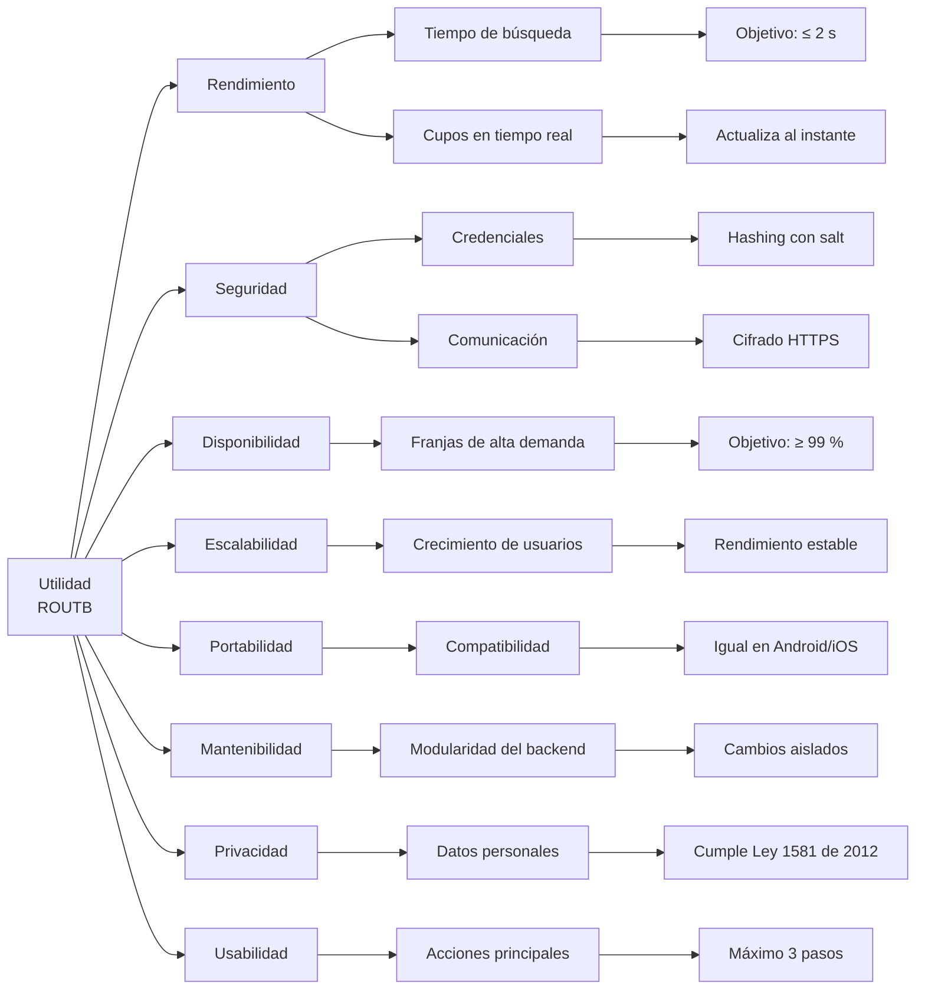

# 10. Requisitos de calidad

Esta sección documenta los atributos de calidad fundamentales para la correcta operación y evolución de ROUTB. Además, se priorizan las metas del sistema con el Árbol de Utilidad y se definen escenarios concretos para evaluar la arquitectura.

## 10.1 Resumen de los requisitos de calidad — Árbol de utilidad

El siguiente árbol de utilidad representa los principales atributos de calidad de ROUTB y sus respectivos subatributos:

## 10.2 Escenarios de calidad

| Atributo de calidad | Fuente del estímulo | Estímulo | Artefacto | Entorno | Respuesta | Medida de respuesta |
|---|---|---|---|---|---|---|
| **Rendimiento** | Pasajero | Consulta los viajes disponibles | ROUTB | Condiciones normales de operación | El sistema procesa la solicitud y muestra los resultados | El 95 % de las solicitudes responde en menos de 2 segundos |
| **Usabilidad** | Pasajero | Desea reservar un viaje disponible | ROUTB | Uso normal de la aplicación móvil | El sistema permite completar la reserva mediante un proceso sencillo | La reserva se completa en un máximo de 3 pasos principales |
| **Seguridad** | Atacante | Intenta interceptar las comunicaciones o acceder a las contraseñas almacenadas | ROUTB | En cualquier momento | Las contraseñas permanecen protegidas mediante hashing con salt y las comunicaciones viajan cifradas | El 100 % de las contraseñas se almacena con hashing y salt, y el 100 % del tráfico usa HTTPS |
| **Disponibilidad** | Estudiante | Accede a la plataforma para consultar o reservar un viaje | ROUTB | Franjas de mayor demanda | Las funcionalidades principales permanecen disponibles | Disponibilidad mínima del 99 % durante las franjas de mayor demanda |
| **Escalabilidad** | Usuarios del sistema | Aumento progresivo de usuarios, viajes y reservas | ROUTB | Periodos de alta demanda | El sistema mantiene su operación normal | Soporta hasta 100 usuarios concurrentes sin errores ni interrupciones |

---
