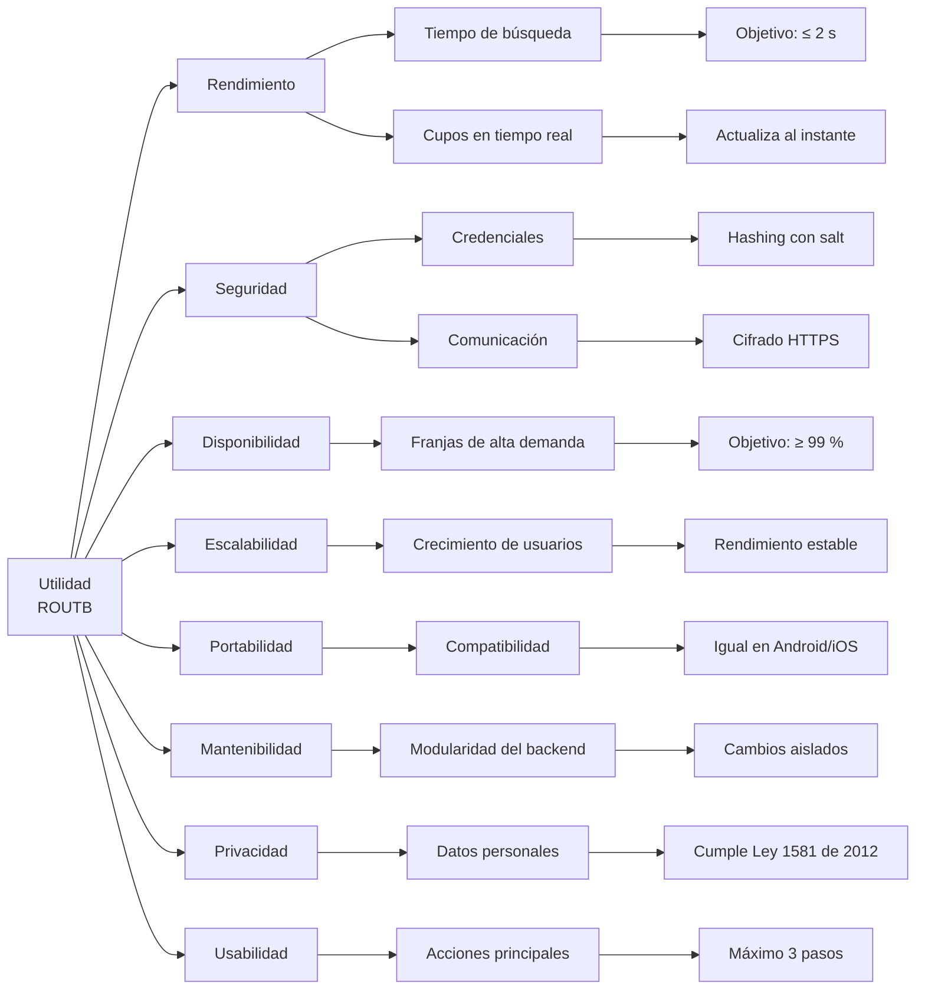

# 10. Requisitos de calidad

Esta sección documenta los atributos de calidad fundamentales para la correcta operación y evolución de ROUTB. Además, se priorizan las metas del sistema con el Árbol de Utilidad y se definen escenarios concretos para evaluar la arquitectura.

## 10.1 Resumen de los requisitos de calidad — Árbol de utilidad

El siguiente árbol de utilidad representa los principales atributos de calidad de ROUTB y sus respectivos subatributos:

## 10.2 Escenarios de calidad

| Atributo de calidad | Fuente del estímulo | Estímulo | Artefacto | Entorno | Respuesta | Medida de respuesta |
|---|---|---|---|---|---|---|
| **Rendimiento** | Pasajero | Consulta los viajes disponibles | ROUTB | Condiciones normales de operación | El sistema procesa la solicitud y muestra los resultados | El 95 % de las solicitudes responde en menos de 3,99 segundos |
| **Usabilidad** | Pasajero | Desea reservar un viaje disponible | ROUTB | Uso normal de la aplicación móvil | El sistema permite completar la reserva mediante un proceso sencillo | La reserva se completa en un máximo de 3 pasos principales |
| **Seguridad** | Atacante | Intenta interceptar las comunicaciones o acceder a las contraseñas almacenadas | ROUTB | En cualquier momento | Las contraseñas permanecen protegidas mediante hashing con salt y las comunicaciones viajan cifradas | El 100 % de las contraseñas se almacena con hashing y salt, y el 100 % del tráfico usa HTTPS |
| **Disponibilidad** | Estudiante | Accede a la plataforma para consultar o reservar un viaje | ROUTB | Franjas de mayor demanda | Las funcionalidades principales permanecen disponibles | Disponibilidad mínima del 99 % durante las franjas de mayor demanda |
| **Escalabilidad** | Usuarios del sistema | Aumento progresivo de usuarios, viajes y reservas | ROUTB | Periodos de alta demanda | El sistema mantiene su operación normal | Soporta hasta 100 usuarios concurrentes sin errores ni interrupciones |

---

## 10.3 Impacto en los requisitos de calidad

### Escenario de consistencia de cupos

Este caso corresponde al atributo de **rendimiento**
en relación con la consistencia de la **disponibilidad**. El estímulo es que
varios estudiantes intenten reservar simultáneamente un mismo recorrido; el
artefacto involucrado es el backend de ROUTB; la respuesta esperada es aceptar
solo las reservas permitidas y conservar la disponibilidad correcta; y el
umbral definido es que el 95 % de las solicitudes responda en menos de 2
segundos.

Cuando varios estudiantes intenten reservar cupos del mismo recorrido
simultáneamente, ROUTB debe garantizar que no se acepten más reservas que
cupos disponibles. La actualización de la disponibilidad debe ser atómica y
las solicitudes que lleguen cuando no existan cupos deben rechazarse sin
producir valores negativos ni inconsistencias.

#### Línea base y procedimiento de medición

- **Herramienta:** prueba automatizada del backend incluida en
  `backend/tests/test_cupos.py`.
- **Carga:** 20 estudiantes intentan reservar al mismo tiempo un recorrido con
  4 cupos disponibles.
- **Medición antes del cambio:** se ejecutó el mismo flujo sobre el estado
  anterior del repositorio. Se enviaron 20 intentos al endpoint de reserva y
  los 20 terminaron con `404 Not Found`, porque el endpoint todavía no
  existía. Por lo tanto, no había reservas procesadas ni control de cupos que
  medir.
- **Medición después del cambio:** se crea el recorrido, se envían las 20
  solicitudes de reserva de forma simultánea y se revisa cuántas fueron
  aceptadas y cuántos cupos quedaron disponibles al finalizar. También se
  registra el tiempo de respuesta del conjunto de solicitudes.

#### Resultado contrastado con el umbral

| Métrica | Antes del cambio | Después del cambio | Umbral | Estado |
|---|---:|---:|---:|---|
| Solicitudes procesadas | 0 de 20 (`404`) | 20 de 20 | 20 de 20 | Cumple |
| Reservas exitosas | No aplicaba | 4 de 20 | Exactamente 4 | Cumple |
| Cupos restantes | No verificable | 0 | 0, sin valores negativos | Cumple |
| Tiempo de respuesta del 95 % de las solicitudes | No aplicaba | 0,2281 s | < 3,99 s | Cumple |

La ejecución produjo dos pruebas exitosas: el flujo normal de creación,
consulta y reserva, y el escenario de 20 intentos sobre 4 cupos. El resultado
fue de 4 reservas aceptadas, 0 cupos restantes y un tiempo de respuesta de
0,2281 segundos para el 95 % de las solicitudes. La línea base anterior
demostró que el flujo no existía; la medición posterior demuestra que ahora
procesa las solicitudes y conserva la disponibilidad. La medición es
reproducible porque mantiene fija la cantidad de solicitudes, los cupos
iniciales y el procedimiento.
