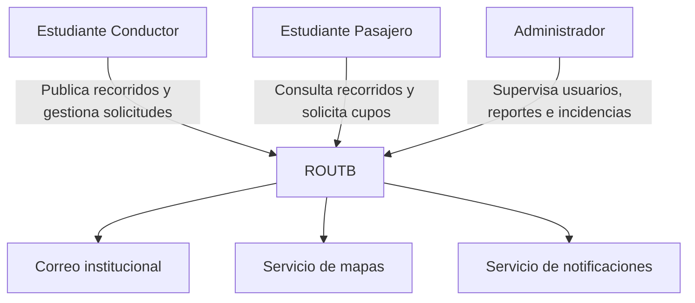

# 

**About arc42**

arc42, the template for documentation of software and system
architecture.

Template Version 9.0-EN. (based upon AsciiDoc version), July 2025

Created, maintained and © by Dr. Peter Hruschka, Dr. Gernot Starke and
contributors. See <https://arc42.org>.

# Introduction and Goals {#section-introduction-and-goals}

ROUTB es una plataforma diseñada para facilitar y gestionar el transporte compartido entre los estudiantes de la Universidad Tecnológica de Bolívar. El sistema busca centralizar la información relacionada con estudiantes conductores, rutas disponibles y cupos libres, permitiendo a los estudiantes consultar las opciones de transporte y reservar un cupo antes del viaje.

La plataforma surge como respuesta a las dificultades que presentan algunos estudiantes para encontrar y coordinar transporte hacia o desde la universidad, especialmente debido a la falta de información sobre conductores disponibles, cupos y horarios de salida.

Objetivo general

Desarrollar una plataforma que permita gestionar y coordinar el transporte compartido entre estudiantes de la Universidad Tecnológica de Bolívar.

Objetivos específicos
- Consultar conductores disponibles.
- Mostrar las rutas de transporte disponibles.
- Visualizar la cantidad de cupos libres.
- Permitir la reserva de un cupo antes del viaje.
- Reducir los tiempos de espera de los estudiantes.
- Mejorar la organización y coordinación de los viajes compartidos.

## Requirements Overview {#_requirements_overview}

ROUTB es una plataforma de movilidad colaborativa dirigida a estudiantes universitarios. El sistema permite a los estudiantes conductores publicar recorridos indicando su origen, destino, horario y cantidad de cupos disponibles, mientras que los estudiantes pasajeros pueden buscar recorridos según sus necesidades y solicitar uno o varios cupos.

Entre las principales funcionalidades del sistema se encuentran la gestión de perfiles, publicación y administración de recorridos, búsqueda y gestión de solicitudes y cupos, ubicación de recogida o destino predeterminado, visualización mediante mapas, notificaciones, historial de recorridos y sistema de valoración.

El sistema también contempla un panel administrativo destinado a la gestión de usuarios, reportes, estadísticas e incidencias.

## Quality Goals {#_quality_goals}

| Prioridad | Objetivo de calidad | Descripción                                                                                                                      |
| --------- | ------------------- | -------------------------------------------------------------------------------------------------------------------------------- |
| 1         | **Rendimiento**     | Las búsquedas y el *matching* deben responder en menos de 2 segundos bajo condiciones normales.                                  |
| 2         | **Seguridad**       | Las contraseñas deben almacenarse mediante hashing con salt y las comunicaciones deben utilizar HTTPS.                           |
| 3         | **Disponibilidad**  | El sistema debe alcanzar una disponibilidad mínima del 99 % durante las franjas de mayor demanda.                                |
| 4         | **Escalabilidad**   | La arquitectura debe permitir el crecimiento del número de usuarios y recorridos sin degradar significativamente el rendimiento. |
| 5         | **Portabilidad**    | La aplicación debe funcionar de manera equivalente en Android e iOS.                                                             |
| 6         | **Mantenibilidad**  | El sistema debe utilizar una arquitectura modular y documentada que facilite su evolución.                                       |
| 7         | **Privacidad**      | Los datos personales deben tratarse de acuerdo con la Ley 1581 de 2012 y las políticas de protección de datos aplicables.        |
| 8         | **Usabilidad**      | Las acciones principales deben poder realizarse en un máximo de tres pasos.                                                      |

## Stakeholders {#_stakeholders}

| Stakeholder                               | Interés / expectativa                                                                                           |
| ----------------------------------------- | --------------------------------------------------------------------------------------------------------------- |
| **Estudiante conductor**                  | Publicar recorridos, gestionar cupos y solicitudes y coordinar los puntos de recogida de los pasajeros.         |
| **Estudiante pasajero**                   | Encontrar recorridos compatibles, solicitar cupos, conocer el estado de sus solicitudes y gestionar sus viajes. |
| **Administrador**                         | Gestionar usuarios, reportes, estadísticas e incidencias y supervisar el funcionamiento de la plataforma.       |
| **Equipo de desarrollo**                  | Mantener una arquitectura modular, mantenible y documentada que permita evolucionar el sistema.                 |
| **Universidad / comunidad universitaria** | Contar con una plataforma orientada a facilitar la movilidad colaborativa entre estudiantes verificados.        |

# Architecture Constraints {#section-architecture-constraints}
Technical Constraints

- Aplicación móvil multiplataforma para Android e iOS.
- Uso de Flutter para la aplicación móvil.
- Uso de FastAPI/Python para el backend.
- Uso de una base de datos relacional.
- Autenticación mediante correo institucional verificado.
- Uso de JWT para la autenticación de sesiones.

Integration Constraints

- Integración con el servicio de correo institucional.
- Integración con un proveedor externo de mapas y
  geolocalización.
- Integración con un servicio de notificaciones push.

Business and Scope Constraints

- El acceso está restringido a estudiantes verificados
  mediante correo institucional.
- ROUTB no gestiona pagos ni transacciones comerciales.
- ROUTB no actúa como operador de transporte.
- La verificación de antecedentes o idoneidad de los
  conductores está fuera del alcance del sistema.

# Context and Scope {#section-context-and-scope}

ROUTB es una plataforma de movilidad colaborativa dirigida a estudiantes universitarios. El sistema permite a estudiantes conductores publicar recorridos y gestionar los cupos disponibles, mientras que los estudiantes pasajeros pueden consultar recorridos, solicitar uno o varios cupos y gestionar sus viajes. Los administradores utilizan la plataforma para supervisar usuarios, reportes, estadísticas e incidencias.

## Business Context {#_business_context}

┌──────────────────┐
│ Usuario          │
│ móvil            │
└────────┬─────────┘
         │ HTTPS
         ▼
┌──────────────────┐
│      ROUTB       │
└────────┬─────────┘
         │
    ┌────┼──────────────┐
    │    │              │
    │ HTTPS/API     Push
    ▼    ▼              ▼
Correo  Mapas      Notificaciones

## Technical Context {#_technical_context}

| Entrada / Salida                 | Origen / Destino                       | Canal                           |
| -------------------------------- | -------------------------------------- | ------------------------------- |
| Credenciales y datos de registro | Usuario → ROUTB                        | HTTPS                           |
| Solicitudes de recorridos        | Usuario → ROUTB                        | HTTPS                           |
| Información de recorridos        | ROUTB → Usuario                        | HTTPS                           |
| Ubicaciones                      | Usuario ↔ ROUTB                        | HTTPS / servicio de mapas       |
| Verificación de correo           | ROUTB ↔ correo institucional           | HTTPS / servicio de correo      |
| Notificaciones                   | ROUTB → usuario                        | Servicio de notificaciones push |
| Datos de mapas                   | Servicio de mapas → ROUTB / aplicación | API                             |

# Solution Strategy {#section-solution-strategy}

# Building Block View {#section-building-block-view}

## Whitebox Overall System {#_whitebox_overall_system}

***\<Overview Diagram\>***

Motivation

:   *\<text explanation\>*

Contained Building Blocks

:   *\<Description of contained building block (black boxes)\>*

Important Interfaces

:   *\<Description of important interfaces\>*

### \<Name black box 1\> {#_name_black_box_1}

*\<Purpose/Responsibility\>*

*\<Interface(s)\>*

*\<(Optional) Quality/Performance Characteristics\>*

*\<(Optional) Directory/File Location\>*

*\<(Optional) Fulfilled Requirements\>*

*\<(optional) Open Issues/Problems/Risks\>*

### \<Name black box 2\> {#_name_black_box_2}

*\<black box template\>*

### \<Name black box n\> {#_name_black_box_n}

*\<black box template\>*

### \<Name interface 1\> {#_name_interface_1}

...​

### \<Name interface m\> {#_name_interface_m}

## Level 2 {#_level_2}

### White Box *\<building block 1\>* {#_white_box_building_block_1}

*\<white box template\>*

### White Box *\<building block 2\>* {#_white_box_building_block_2}

*\<white box template\>*

...​

### White Box *\<building block m\>* {#_white_box_building_block_m}

*\<white box template\>*

## Level 3 {#_level_3}

### White Box \<\_building block x.1\_\> {#_white_box_building_block_x_1}

*\<white box template\>*

### White Box \<\_building block x.2\_\> {#_white_box_building_block_x_2}

*\<white box template\>*

### White Box \<\_building block y.1\_\> {#_white_box_building_block_y_1}

*\<white box template\>*

# Runtime View {#section-runtime-view}

## \<Runtime Scenario 1\> {#_runtime_scenario_1}

-   *\<insert runtime diagram or textual description of the scenario\>*

-   *\<insert description of the notable aspects of the interactions
    between the building block instances depicted in this diagram.\>*

## \<Runtime Scenario 2\> {#_runtime_scenario_2}

## ...​

## \<Runtime Scenario n\> {#_runtime_scenario_n}

# Deployment View {#section-deployment-view}

## Infrastructure Level 1 {#_infrastructure_level_1}

***\<Overview Diagram\>***

Motivation

:   *\<explanation in text form\>*

Quality and/or Performance Features

:   *\<explanation in text form\>*

Mapping of Building Blocks to Infrastructure

:   *\<description of the mapping\>*

## Infrastructure Level 2 {#_infrastructure_level_2}

### *\<Infrastructure Element 1\>* {#_infrastructure_element_1}

*\<diagram + explanation\>*

### *\<Infrastructure Element 2\>* {#_infrastructure_element_2}

*\<diagram + explanation\>*

...​

### *\<Infrastructure Element n\>* {#_infrastructure_element_n}

*\<diagram + explanation\>*

# Cross-cutting Concepts {#section-concepts}

## *\<Concept 1\>* {#_concept_1}

*\<explanation\>*

## *\<Concept 2\>* {#_concept_2}

*\<explanation\>*

...​

## *\<Concept n\>* {#_concept_n}

*\<explanation\>*

# Architecture Decisions {#section-design-decisions}

# Quality Requirements {#section-quality-scenarios}

## Quality Requirements Overview {#_quality_requirements_overview}

## Quality Scenarios {#_quality_scenarios}

# Risks and Technical Debts {#section-technical-risks}

# Glossary {#section-glossary}

+----------------------+-----------------------------------------------+
| Term                 | Definition                                    |
+======================+===============================================+
| *\<Term-1\>*         | *\<definition-1\>*                            |
+----------------------+-----------------------------------------------+
| *\<Term-2\>*         | *\<definition-2\>*                            |
+----------------------+-----------------------------------------------+
