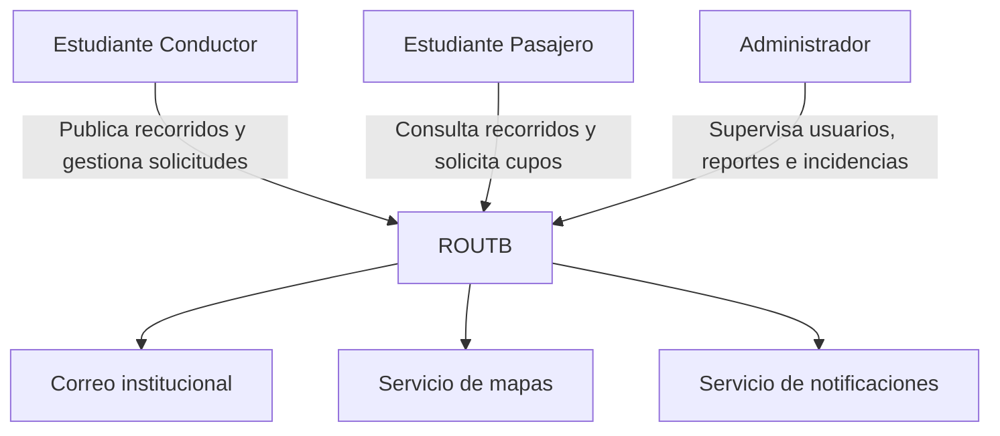
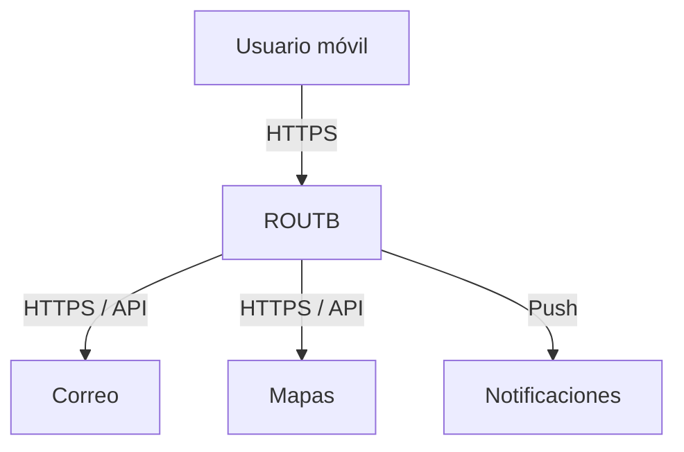

# 

**About arc42**

arc42, the template for documentation of software and system
architecture.

Template Version 9.0-EN. (based upon AsciiDoc version), July 2025

Created, maintained and © by Dr. Peter Hruschka, Dr. Gernot Starke and
contributors. See <https://arc42.org>.

# Introduction and Goals

ROUTB es una plataforma diseñada para facilitar y gestionar el transporte compartido entre los estudiantes de la Universidad Tecnológica de Bolívar. El sistema busca centralizar la información relacionada con estudiantes conductores, rutas disponibles y cupos libres, permitiendo a los estudiantes consultar las opciones de transporte y reservar un cupo antes del viaje.

La plataforma surge como respuesta a las dificultades que presentan algunos estudiantes para encontrar y coordinar transporte hacia o desde la universidad, especialmente debido a la falta de información sobre conductores disponibles, cupos y horarios de salida.

## Objetivo general

Desarrollar una plataforma que permita gestionar y coordinar el transporte compartido entre estudiantes de la Universidad Tecnológica de Bolívar.

## Objetivos específicos
- Consultar conductores disponibles.
- Mostrar las rutas de transporte disponibles.
- Visualizar la cantidad de cupos libres.
- Permitir la reserva de un cupo antes del viaje.
- Reducir los tiempos de espera de los estudiantes.
- Mejorar la organización y coordinación de los viajes compartidos.

## Requirements Overview

ROUTB es una plataforma de movilidad colaborativa dirigida a estudiantes universitarios. El sistema permite a los estudiantes conductores publicar recorridos indicando su origen, destino, horario y cantidad de cupos disponibles, mientras que los estudiantes pasajeros pueden buscar recorridos según sus necesidades y solicitar uno o varios cupos.

Entre las principales funcionalidades del sistema se encuentran la gestión de perfiles, publicación y administración de recorridos, búsqueda y gestión de solicitudes y cupos, ubicación de recogida o destino predeterminado, visualización mediante mapas, notificaciones, historial de recorridos y sistema de valoración.

El sistema también contempla un panel administrativo destinado a la gestión de usuarios, reportes, estadísticas e incidencias.

## Quality Goals

| Prioridad | Objetivo de calidad | Descripción                                                                                                                      |
| --------- | ------------------- | -------------------------------------------------------------------------------------------------------------------------------- |
| 1         | **Rendimiento**     | Las búsquedas y el *matching* deben responder en menos de 2 segundos bajo condiciones normales.                                  |
| 2         | **Seguridad**       | Las contraseñas deben almacenarse mediante hashing con salt y las comunicaciones deben utilizar HTTPS.                           |
| 3         | **Disponibilidad**  | El sistema debe alcanzar una disponibilidad mínima del 99 % durante las franjas de mayor demanda.                                |
| 4         | **Escalabilidad**   | La arquitectura debe permitir el crecimiento del número de usuarios y recorridos sin degradar significativamente el rendimiento. |
| 5         | **Portabilidad**    | La aplicación debe funcionar de manera equivalente en Android e iOS.                                                             |
| 6         | **Mantenibilidad**  | El sistema debe utilizar una arquitectura modular y documentada que facilite su evolución.                                       |
| 7         | **Privacidad**      | Los datos personales deben tratarse de acuerdo con la Ley 1581 de 2012 y las políticas de protección de datos aplicables.        |
| 8         | **Usabilidad**      | Las acciones principales deben poder realizarse en un máximo de tres pasos.                                                      |

### Utility Tree

El siguiente árbol de utilidad representa los principales atributos de calidad de ROUTB y sus respectivos subatributos:

```text
ROUTB
│
└── Calidad del sistema
    │
    ├── Rendimiento
    │   ├── Tiempo de respuesta
    │   └── Actualización de información en tiempo real
    │
    ├── Usabilidad
    │   ├── Facilidad de uso
    │   └── Navegación sencilla
    │
    ├── Seguridad
    │   ├── Autenticación
    │   └── Protección de datos
    │
    ├── Disponibilidad
    │   └── Acceso a funcionalidades principales
    │
    └── Escalabilidad
        └── Crecimiento
```

### Quality Scenarios

| Atributo de calidad | Escenario | Medida |
|---|---|---|
| Rendimiento | Cuando un pasajero consulta los viajes disponibles, ROUTB procesa la solicitud y muestra los resultados. | El 95 % de las solicitudes debe responder en menos de 2 segundos bajo condiciones normales. |
| Usabilidad | Cuando un pasajero desea reservar un viaje disponible, el sistema permite realizar la reserva mediante un proceso sencillo y comprensible. | La reserva debe poder completarse en un máximo de 3 pasos principales. |
| Seguridad | Cuando un usuario no autorizado intenta acceder a un recurso protegido, ROUTB rechaza la solicitud. | El 100 % de los endpoints protegidos debe validar la autenticación y autorización. |
| Disponibilidad | Cuando un estudiante accede a la plataforma para consultar o reservar un viaje, las funcionalidades principales deben estar disponibles. | El sistema debe mantener una disponibilidad mínima del 99 % mensual. |
| Escalabilidad | Aumento progresivo de usuarios, viajes y reservas durante periodos de alta demanda. | Soportar 100 usuarios concurrentes sin errores ni interrupciones del servicio. |

## Stakeholders

| Stakeholder                               | Interés / expectativa                                                                                           |
| ----------------------------------------- | --------------------------------------------------------------------------------------------------------------- |
| **Estudiante conductor**                  | Publicar recorridos, gestionar cupos y solicitudes y coordinar los puntos de recogida de los pasajeros.         |
| **Estudiante pasajero**                   | Encontrar recorridos compatibles, solicitar cupos, conocer el estado de sus solicitudes y gestionar sus viajes. |
| **Administrador**                         | Gestionar usuarios, reportes, estadísticas e incidencias y supervisar el funcionamiento de la plataforma.       |
| **Equipo de desarrollo**                  | Mantener una arquitectura modular, mantenible y documentada que permita evolucionar el sistema.                 |
| **Universidad / comunidad universitaria** | Contar con una plataforma orientada a facilitar la movilidad colaborativa entre estudiantes verificados.        |


# Architecture Constraints
Technical Constraints

- Uso de Flutter para la aplicación móvil, ya que permite
  cubrir Android e iOS con una sola base de código y se
  ajusta al tiempo y recursos limitados del equipo.
- Uso de FastAPI/Python para el backend, por ser un framework
  ligero y rápido de implementar, acorde con la experiencia
  del equipo y el tiempo disponible en el semestre.
- Uso de una base de datos relacional, dado que la información
  del dominio (usuarios, recorridos, cupos, solicitudes) tiene
  relaciones claras entre sí que se ajustan bien a este modelo.
- Uso de JWT para la autenticación de sesiones, al ser un
  estándar para autenticación sin estado en APIs REST, lo que
  facilita la escalabilidad del backend.

Integration Constraints

- Integración con un proveedor externo de mapas y
  geolocalización, ya que el equipo no cuenta con los recursos
  para desarrollar un motor de mapas propio.
- Integración con un servicio de notificaciones push, necesario
  para informar a los usuarios sobre cambios en sus recorridos
  o solicitudes sin depender de que tengan la app abierta.

Business and Scope Constraints

- ROUTB no gestiona pagos ni transacciones comerciales, dado que
  el transporte compartido se basa en acuerdos informales entre
  estudiantes y no en un servicio comercial regulado.
- ROUTB no actúa como operador de transporte, ya que los
  conductores son estudiantes que comparten su propio vehículo
  y no una flota contratada por la plataforma.
- La verificación de antecedentes o idoneidad de los conductores
  está fuera del alcance del sistema, porque implicaría acceso a
  bases de datos oficiales y procesos legales que exceden las
  posibilidades de un proyecto académico.
- El desarrollo debe ajustarse al cronograma académico del
  semestre, con entregas incrementales por semana, lo cual
  limita el alcance funcional que el equipo puede completar en
  el tiempo disponible.

# Context and Scope

ROUTB es una plataforma de movilidad colaborativa dirigida a estudiantes universitarios. El sistema permite a estudiantes conductores publicar recorridos y gestionar los cupos disponibles, mientras que los estudiantes pasajeros pueden consultar recorridos, solicitar uno o varios cupos y gestionar sus viajes. Los administradores utilizan la plataforma para supervisar usuarios, reportes, estadísticas e incidencias.

## Business Context



## Technical Context

| Entrada / Salida                 | Origen / Destino                       | Canal                           |
| -------------------------------- | -------------------------------------- | ------------------------------- |
| Credenciales y datos de registro | Usuario → ROUTB                        | HTTPS                           |
| Solicitudes de recorridos        | Usuario → ROUTB                        | HTTPS                           |
| Información de recorridos        | ROUTB → Usuario                        | HTTPS                           |
| Ubicaciones                      | Usuario ↔ ROUTB                        | HTTPS / servicio de mapas       |
| Verificación de correo           | ROUTB ↔ correo institucional           | HTTPS / servicio de correo      |
| Notificaciones                   | ROUTB → usuario                        | Servicio de notificaciones push |
| Datos de mapas                   | Servicio de mapas → ROUTB / aplicación | API                             |


# Solution Strategy

# Building Block View

## Whitebox Overall System

***\<Overview Diagram\>***

Motivation

:   *\<text explanation\>*

Contained Building Blocks

:   *\<Description of contained building block (black boxes)\>*

Important Interfaces

:   *\<Description of important interfaces\>*

### \<Name black box 1\> {#_name_black_box_1}

*\<Purpose/Responsibility\>*

*\<Interface(s)\>*

*\<(Optional) Quality/Performance Characteristics\>*

*\<(Optional) Directory/File Location\>*

*\<(Optional) Fulfilled Requirements\>*

*\<(optional) Open Issues/Problems/Risks\>*

### \<Name black box 2\> {#_name_black_box_2}

*\<black box template\>*

### \<Name black box n\> {#_name_black_box_n}

*\<black box template\>*

### \<Name interface 1\> {#_name_interface_1}

...​

### \<Name interface m\> {#_name_interface_m}

## Level 2 {#_level_2}

### White Box *\<building block 1\>* {#_white_box_building_block_1}

*\<white box template\>*

### White Box *\<building block 2\>* {#_white_box_building_block_2}

*\<white box template\>*

...​

### White Box *\<building block m\>* {#_white_box_building_block_m}

*\<white box template\>*

## Level 3 {#_level_3}

### White Box \<\_building block x.1\_\> {#_white_box_building_block_x_1}

*\<white box template\>*

### White Box \<\_building block x.2\_\> {#_white_box_building_block_x_2}

*\<white box template\>*

### White Box \<\_building block y.1\_\> {#_white_box_building_block_y_1}

*\<white box template\>*

# Runtime View {#section-runtime-view}

## \<Runtime Scenario 1\> {#_runtime_scenario_1}

-   *\<insert runtime diagram or textual description of the scenario\>*

-   *\<insert description of the notable aspects of the interactions
    between the building block instances depicted in this diagram.\>*

## \<Runtime Scenario 2\> {#_runtime_scenario_2}

## ...​

## \<Runtime Scenario n\> {#_runtime_scenario_n}

# Deployment View {#section-deployment-view}

## Infrastructure Level 1 {#_infrastructure_level_1}

***\<Overview Diagram\>***

Motivation

:   *\<explanation in text form\>*

Quality and/or Performance Features

:   *\<explanation in text form\>*

Mapping of Building Blocks to Infrastructure

:   *\<description of the mapping\>*

## Infrastructure Level 2 {#_infrastructure_level_2}

### *\<Infrastructure Element 1\>* {#_infrastructure_element_1}

*\<diagram + explanation\>*

### *\<Infrastructure Element 2\>* {#_infrastructure_element_2}

*\<diagram + explanation\>*

...​

### *\<Infrastructure Element n\>* {#_infrastructure_element_n}

*\<diagram + explanation\>*

# Cross-cutting Concepts {#section-concepts}

## *\<Concept 1\>* {#_concept_1}

*\<explanation\>*

## *\<Concept 2\>* {#_concept_2}

*\<explanation\>*

...​

## *\<Concept n\>* {#_concept_n}

*\<explanation\>*

# Architecture Decisions {#section-design-decisions}

# Quality Requirements {#section-quality-scenarios}

## Quality Requirements Overview {#_quality_requirements_overview}

## Quality Scenarios {#_quality_scenarios}

# Risks and Technical Debts {#section-technical-risks}

# Glossary {#section-glossary}

+----------------------+-----------------------------------------------+
| Term                 | Definition                                    |
+======================+===============================================+
| *\<Term-1\>*         | *\<definition-1\>*                            |
+----------------------+-----------------------------------------------+
| *\<Term-2\>*         | *\<definition-2\>*                            |
+----------------------+-----------------------------------------------+
