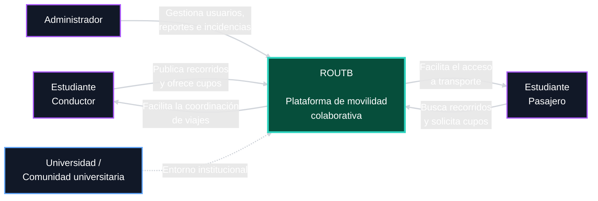
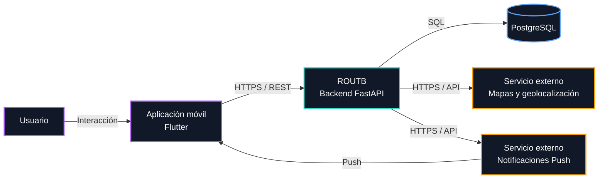

# 

**About arc42**

arc42, the template for documentation of software and system
architecture.

Template Version 9.0-EN. (based upon AsciiDoc version), July 2025

Created, maintained and © by Dr. Peter Hruschka, Dr. Gernot Starke and
contributors. See <https://arc42.org>.

# Introducción y objetivos

ROUTB es una plataforma diseñada para facilitar y gestionar el transporte compartido entre los estudiantes de la Universidad Tecnológica de Bolívar. El sistema busca centralizar la información relacionada con estudiantes conductores, rutas disponibles y cupos libres, permitiendo a los estudiantes consultar las opciones de transporte y reservar un cupo antes del viaje.

La plataforma surge como respuesta a las dificultades que presentan algunos estudiantes para encontrar y coordinar transporte hacia o desde la universidad, especialmente debido a la falta de información sobre conductores disponibles, cupos y horarios de salida.

## Objetivo general

Desarrollar una plataforma que permita gestionar y coordinar el transporte compartido entre estudiantes de la Universidad Tecnológica de Bolívar.

## Objetivos específicos
- Consultar conductores disponibles.
- Mostrar las rutas de transporte disponibles.
- Visualizar la cantidad de cupos libres.
- Permitir la reserva de un cupo antes del viaje.
- Reducir los tiempos de espera de los estudiantes.
- Mejorar la organización y coordinación de los viajes compartidos.

## Descripción general de los requisitos

ROUTB es una plataforma de movilidad colaborativa dirigida a estudiantes universitarios. El sistema permite a los estudiantes conductores publicar recorridos indicando su origen, destino, horario y cantidad de cupos disponibles, mientras que los estudiantes pasajeros pueden buscar recorridos según sus necesidades y solicitar uno o varios cupos.

Entre las principales funcionalidades del sistema se encuentran la gestión de perfiles, publicación y administración de recorridos, búsqueda y gestión de solicitudes y cupos, ubicación de recogida o destino predeterminado, visualización mediante mapas, notificaciones, historial de recorridos y sistema de valoración.

El sistema también contempla un panel administrativo destinado a la gestión de usuarios, reportes, estadísticas e incidencias.

## Objetivos de calidad

| Prioridad | Objetivo de calidad | Descripción                                                                                                                      |
| --------- | ------------------- | -------------------------------------------------------------------------------------------------------------------------------- |
| 1         | **Rendimiento**     | Las búsquedas deben responder en menos de 2 segundos bajo condiciones normales.                                  |
| 2         | **Seguridad**       | Las contraseñas deben almacenarse mediante hashing con salt y las comunicaciones deben utilizar HTTPS.                           |
| 3         | **Disponibilidad**  | El sistema debe alcanzar una disponibilidad mínima del 99 % durante las franjas de mayor demanda.                                |
| 4         | **Escalabilidad**   | La arquitectura debe permitir el crecimiento del número de usuarios y recorridos sin degradar significativamente el rendimiento. |
| 5         | **Portabilidad**    | La aplicación debe funcionar de manera equivalente en Android e iOS.                                                             |
| 6         | **Mantenibilidad**  | El sistema debe utilizar una arquitectura modular y documentada que facilite su evolución.                                       |
| 7         | **Privacidad**      | Los datos personales deben tratarse de acuerdo con la Ley 1581 de 2012 y las políticas de protección de datos aplicables.        |
| 8         | **Usabilidad**      | Las acciones principales deben poder realizarse en un máximo de tres pasos.                                                      |

### Árbol de utilidad

El siguiente árbol de utilidad representa los principales atributos de calidad de ROUTB y sus respectivos subatributos:

```text
ROUTB
│
└── Calidad del sistema
    │
    ├── Rendimiento
    │   ├── Tiempo de respuesta
    │   └── Actualización de información en tiempo real
    │
    ├── Usabilidad
    │   ├── Facilidad de uso
    │   └── Navegación sencilla
    │
    ├── Seguridad
    │   ├── Autenticación
    │   └── Protección de datos
    │
    ├── Disponibilidad
    │   └── Acceso a funcionalidades principales
    │
    └── Escalabilidad
        └── Crecimiento
```

### Escenarios de calidad

| Atributo de calidad | Escenario | Medida |
|---|---|---|
| Rendimiento | Cuando un pasajero consulta los viajes disponibles, ROUTB procesa la solicitud y muestra los resultados. | El 95 % de las solicitudes debe responder en menos de 2 segundos bajo condiciones normales. |
| Usabilidad | Cuando un pasajero desea reservar un viaje disponible, el sistema permite realizar la reserva mediante un proceso sencillo y comprensible. | La reserva debe poder completarse en un máximo de 3 pasos principales. |
| Seguridad | Cuando un usuario no autorizado intenta acceder a un recurso protegido, ROUTB rechaza la solicitud. | El 100 % de los endpoints protegidos debe validar la autenticación y autorización. |
| Disponibilidad | Cuando un estudiante accede a la plataforma para consultar o reservar un viaje, las funcionalidades principales deben estar disponibles. | El sistema debe mantener una disponibilidad mínima del 99 % mensual. |
| Escalabilidad | Aumento progresivo de usuarios, viajes y reservas durante periodos de alta demanda. | Soportar 100 usuarios concurrentes sin errores ni interrupciones del servicio. |

## Stakeholders / Interesados

| Stakeholder                               | Interés / expectativa                                                                                           |
| ----------------------------------------- | --------------------------------------------------------------------------------------------------------------- |
| **Estudiante conductor**                  | Publicar recorridos, gestionar cupos y solicitudes y coordinar los puntos de recogida de los pasajeros.         |
| **Estudiante pasajero**                   | Encontrar recorridos compatibles, solicitar cupos, conocer el estado de sus solicitudes y gestionar sus viajes. |
| **Administrador**                         | Gestionar usuarios, reportes, estadísticas e incidencias y supervisar el funcionamiento de la plataforma.       |
| **Equipo de desarrollo**                  | Mantener una arquitectura modular, mantenible y documentada que permita evolucionar el sistema.                 |
| **Universidad / comunidad universitaria** | Contar con una plataforma orientada a facilitar la movilidad colaborativa entre estudiantes verificados.        |


# Restricciones de arquitectura
Restricciones técnicas

- Uso de Flutter para la aplicación móvil, ya que permite
  cubrir Android e iOS con una sola base de código y se
  ajusta al tiempo y recursos limitados del equipo.
- Uso de FastAPI/Python para el backend, por ser un framework
  ligero y rápido de implementar, acorde con la experiencia
  del equipo y el tiempo disponible en el semestre.
- Uso de una base de datos relacional, dado que la información
  del dominio (usuarios, recorridos, cupos, solicitudes) tiene
  relaciones claras entre sí que se ajustan bien a este modelo.
- Uso de JWT para la autenticación de sesiones, al ser un
  estándar para autenticación sin estado en APIs REST, lo que
  facilita la escalabilidad del backend.

Restricciones de integración

- Integración con un proveedor externo de mapas y
  geolocalización, ya que el equipo no cuenta con los recursos
  para desarrollar un motor de mapas propio.
- Integración con un servicio de notificaciones push, necesario
  para informar a los usuarios sobre cambios en sus recorridos
  o solicitudes sin depender de que tengan la app abierta.

Restricciones comerciales y de alcance

- ROUTB no gestiona pagos ni transacciones comerciales, dado que
  el transporte compartido se basa en acuerdos informales entre
  estudiantes y no en un servicio comercial regulado.
- ROUTB no actúa como operador de transporte, ya que los
  conductores son estudiantes que comparten su propio vehículo
  y no una flota contratada por la plataforma.
- La verificación de antecedentes o idoneidad de los conductores
  está fuera del alcance del sistema, porque implicaría acceso a
  bases de datos oficiales y procesos legales que exceden las
  posibilidades de un proyecto académico.
- El desarrollo debe ajustarse al cronograma académico del
  semestre, con entregas incrementales por semana, lo cual
  limita el alcance funcional que el equipo puede completar en
  el tiempo disponible.

# Contexto y alcance

ROUTB es una plataforma de movilidad colaborativa dirigida a estudiantes universitarios. El sistema permite a estudiantes conductores publicar recorridos y gestionar los cupos disponibles, mientras que los estudiantes pasajeros pueden consultar recorridos, solicitar uno o varios cupos y gestionar sus viajes. Los administradores utilizan la plataforma para supervisar usuarios, reportes, estadísticas e incidencias.

## Contexto empresarial

Representa la relación entre la plataforma y los principales actores involucrados en la movilidad colaborativa universitaria.


| Interfaz                                  | Relación con ROUTB                                                            |
| ----------------------------------------- | ----------------------------------------------------------------------------- |
| **Estudiante conductor**                  | Ofrece recorridos, administra cupos y gestiona solicitudes.                   |
| **Estudiante pasajero**                   | Consulta recorridos, solicita cupos y gestiona sus viajes.                    |
| **Administrador**                         | Supervisa usuarios, reportes, estadísticas e incidencias.                     |
| **Universidad / comunidad universitaria** | Representa el entorno institucional y la población objetivo de la plataforma. |


## Contexto tecnico

Representa los principales sistemas y canales mediante los cuales ROUTB recibe, procesa, almacena e intercambia información.



| Interfaz                          | Canal            | Propósito                                                                        |
| --------------------------------- | ---------------- | -------------------------------------------------------------------------------- |
| **Usuario ↔ Aplicación móvil**    | Interfaz gráfica | Registro, autenticación, consulta y gestión de recorridos, solicitudes y viajes. |
| **Flutter ↔ FastAPI**             | HTTPS / REST     | Intercambio de información entre la aplicación móvil y el backend.               |
| **FastAPI ↔ PostgreSQL**          | SQL              | Persistencia y consulta de usuarios, recorridos, solicitudes, cupos e historial. |
| **FastAPI ↔ Servicio de mapas**   | HTTPS / API      | Consulta de mapas, ubicaciones y geolocalización.                                |
| **FastAPI ↔ Notificaciones Push** | HTTPS / API      | Envío de notificaciones relacionadas con recorridos y solicitudes.               |
| **Notificaciones Push → Flutter** | Push             | Entrega de notificaciones al dispositivo del usuario.                            |


| Entrada / Salida                 | Origen / Destino          | Canal                       |
| -------------------------------- | ------------------------- | --------------------------- |
| Credenciales y datos de registro | Usuario → ROUTB           | HTTPS / REST                |
| Solicitudes de recorridos        | Usuario → ROUTB           | HTTPS / REST                |
| Información de recorridos        | ROUTB → Usuario           | HTTPS / REST                |
| Gestión de cupos y solicitudes   | Usuario ↔ ROUTB           | HTTPS / REST                |
| Ubicaciones                      | Usuario ↔ ROUTB           | HTTPS / REST + API de mapas |
| Datos de mapas                   | Servicio de mapas → ROUTB | HTTPS / API                 |
| Datos persistentes               | ROUTB ↔ PostgreSQL        | SQL                         |
| Notificaciones                   | ROUTB → Usuario           | Servicio Push               |


# Solution Strategy

## Decisiones tecnológicas

| Tecnología | Rol en la arquitectura | Justificación |
| --- | --- | --- |
| **Flutter** | Framework para el cliente móvil (Android/iOS) | Permite un único código base multiplataforma, cumpliendo el requisito de portabilidad con menor esfuerzo de desarrollo para un equipo reducido de 4 integrantes. |
| **FastAPI (Python)** | Framework del backend / API REST | Alto rendimiento para operaciones asíncronas, tipado y validación de datos integrados, y curva de aprendizaje adecuada para un proyecto académico. |
| **PostgreSQL** | Base de datos relacional |Modelo relacional adecuado para las entidades del dominio (usuarios, recorridos, cupos, solicitudes) y sus relaciones; soporta las consultas de localización necesarias para la búsqueda de recorridos. |
| **JWT** | Autenticación y gestión de sesiones | Mecanismo *stateless* que simplifica la escalabilidad horizontal del backend y se integra naturalmente con FastAPI. |
| **HTTPS** | Protección de las comunicaciones cliente-servidor | Requisito directo de seguridad. |
| **API de mapas y geolocalización** (Google Maps API / OpenStreetMap) | Visualización de rutas y cálculo de coincidencias | Se trata como una dependencia externa integrada mediante una interfaz propia, evitando acoplar el dominio de negocio al proveedor específico. |
| **Servicio de notificaciones push** (p. ej. Firebase Cloud Messaging) | Notificaciones a usuarios | Integración externa desacoplada mediante un adaptador, permitiendo sustituir el proveedor sin afectar el core del sistema. |

## Decisiones de descomposición y organización del sistema

La solución se organiza en torno a cuatro grandes bloques, que se detallarán en la vista de bloques de construcción (sección 5):

- **Aplicación móvil (Flutter):** capa de presentación e interacción con el usuario (conductor, pasajero, administrador).
- **Backend / API (FastAPI):** contiene la lógica de negocio — autenticación, gestión de recorridos y cupos, reputación y estadísticas — expuesta como API REST.
- **Persistencia de datos (PostgreSQL):** almacenamiento de usuarios, recorridos, solicitudes, historial y reputación.
- **Integraciones externas:** servicio de mapas/geolocalización y servicio de notificaciones push. Estas se tratan como dependencias externas, aisladas del dominio mediante interfaces de integración, de modo que puedan reemplazarse sin impactar la lógica central del negocio.

Esta separación busca mantener el sistema modular y comprensible para los cuatro integrantes del equipo, permitiendo que distintos miembros trabajen en paralelo sobre el cliente, el backend y las integraciones sin generar dependencias cruzadas fuertes

## Enfoque para alcanzar los objetivos de calidad clave

| Objetivo de calidad (prioridad) | Estrategia arquitectónica |
| --- | --- |
| Rendimiento (1) | Búsquedas optimizadas con consultas geoespaciales indexadas en PostgreSQL/PostGIS; operaciones críticas de búsqueda diseñadas para responder en menos de 2 segundos. |
| Seguridad (2) | Hashing de contraseñas con salt, autenticación basada en JWT, y HTTPS obligatorio en toda comunicación cliente-servidor. |
| Disponibilidad (3) | Backend sin estado (stateless, gracias a JWT) que facilita el despliegue de múltiples instancias durante las franjas de mayor demanda. |
| Escalabilidad (4) | El monolito modular permite que, si un módulo concentra mayor carga (por ejemplo, búsqueda de recorridos), pueda optimizarse o incluso extraerse a futuro como servicio independiente sin rediseñar el resto del sistema. Ver [ADR 0001](adr/0001-decisiones-arquitectonicas.md). |
| Portabilidad (5) | Un único código base en Flutter para Android e iOS. |
| Mantenibilidad (6) | El backend se organiza como monolito modular, dividido en módulos independientes por dominio (autenticación, recorridos, búsqueda, reputación, administración), lo que permite a los desarrolladores del equipo trabajar en paralelo sobre distintos módulos, aislar pruebas y localizar cambios sin afectar el resto del sistema. Ver [ADR 0001](adr/0001-decisiones-arquitectonicas.md). |
| Privacidad (7) | Tratamiento de datos personales conforme a la Ley 1581 de 2012. |
| Usabilidad (8) | Diseño mobile-first con flujos de máximo 3 pasos para las acciones principales (publicar, buscar, solicitar un cupo). |

## Decisiones organizacionales

- El desarrollo se distribuye entre los cuatro integrantes del equipo según los bloques definidos (cliente móvil, backend/API, persistencia, integraciones), minimizando el trabajo simultáneo sobre un mismo componente.
- Al ser un proyecto académico de un semestre, se prioriza una arquitectura simple y bien documentada por sobre patrones más complejos (p. ej. microservicios), reservando la posibilidad de evolucionar hacia una arquitectura más distribuida si el sistema creciera más allá del alcance actual.
- Las integraciones externas (mapas, notificaciones) se aíslan explícitamente del dominio de negocio para poder desarrollarlas, probarlas y sustituirlas de forma independiente.


# 5. Building Block View

## 5.1 Whitebox del sistema completo

**Overview Diagram:** *(pendiente — insertar diagrama de bloques del sistema)*

**Motivation:** *(pendiente — explicación en texto)*

**Contained Building Blocks:** *(pendiente — descripción de los building blocks contenidos, cajas negras)*

**Important Interfaces:** *(pendiente — descripción de las interfaces importantes)*

### Building block 1 — *(pendiente: nombre)*

- *Propósito / Responsabilidad:* pendiente
- *Interfaz(ces):* pendiente
- *(Opcional) Características de calidad/rendimiento:* pendiente
- *(Opcional) Ubicación de directorio/archivo:* pendiente
- *(Opcional) Requisitos cumplidos:* pendiente
- *(Opcional) Problemas/riesgos abiertos:* pendiente

### Building block 2 — *(pendiente: nombre)*

*(pendiente — usar la misma plantilla del building block 1)*

### Building block n — *(pendiente: nombre)*

*(pendiente — usar la misma plantilla del building block 1)*

### Interfaces

*(pendiente — una subsección por cada interfaz relevante)*

## 5.2 Nivel 2

*(pendiente — un whitebox por cada building block de nivel 1 que se desee detallar)*

## 5.3 Nivel 3

*(pendiente — un whitebox por cada building block de nivel 2 que se desee detallar)*

---

# 6. Runtime View

*(pendiente — un escenario de ejecución por cada flujo relevante: por ejemplo, "publicar un recorrido", "buscar y reservar un cupo", "autenticación de usuario")*

## 6.1 Escenario de runtime 1 — *(pendiente: nombre)*

- *(pendiente — diagrama de secuencia o descripción textual del escenario)*
- *(pendiente — descripción de los aspectos relevantes de las interacciones entre los building blocks representados)*

## 6.2 Escenario de runtime 2 — *(pendiente: nombre)*

*(pendiente)*

## 6.n Escenario de runtime n — *(pendiente: nombre)*

*(pendiente)*

---

# 7. Deployment View

## 7.1 Infraestructura — Nivel 1

**Overview Diagram:** *(pendiente — insertar diagrama de despliegue)*

**Motivation:** *(pendiente — explicación en texto)*

**Quality and/or Performance Features:** *(pendiente — explicación en texto)*

**Mapping of Building Blocks to Infrastructure:** *(pendiente — descripción de la asignación de building blocks a la infraestructura)*

## 7.2 Infraestructura — Nivel 2

### Elemento de infraestructura 1 — *(pendiente: nombre)*

*(pendiente — diagrama + explicación)*

### Elemento de infraestructura 2 — *(pendiente: nombre)*

*(pendiente — diagrama + explicación)*

### Elemento de infraestructura n — *(pendiente: nombre)*

*(pendiente — diagrama + explicación)*

---

# 8. Cross-cutting Concepts

*(pendiente — un subapartado por cada concepto transversal: por ejemplo, seguridad, manejo de errores, internacionalización, persistencia)*

## 8.1 Concepto 1 — *(pendiente: nombre)*

*(pendiente — explicación)*

## 8.2 Concepto 2 — *(pendiente: nombre)*

*(pendiente — explicación)*

## 8.n Concepto n — *(pendiente: nombre)*

*(pendiente — explicación)*

---

# 9. Architecture Decisions

*(pendiente — enlazar aquí los ADR del proyecto, p. ej. [ADR 0001](adr/0001-decisiones-arquitectonicas.md))*

---

# 10. Quality Requirements

## 10.1 Quality Requirements Overview — Árbol de utilidad

El siguiente árbol de utilidad representa los principales atributos de calidad de ROUTB y sus respectivos subatributos:

```text
ROUTB
│
└── Calidad del sistema
    │
    ├── Rendimiento
    │   ├── Tiempo de respuesta
    │   └── Actualización de información en tiempo real
    │
    ├── Usabilidad
    │   ├── Facilidad de uso
    │   └── Navegación sencilla
    │
    ├── Seguridad
    │   ├── Autenticación
    │   └── Protección de datos
    │
    ├── Disponibilidad
    │   └── Acceso a funcionalidades principales
    │
    └── Escalabilidad
        └── Crecimiento
```

> *(pendiente — completar el árbol con Portabilidad, Mantenibilidad y Privacidad, y añadir los valores de Impacto y Riesgo de cada hoja.)*

## 10.2 Quality Scenarios

| Atributo de calidad | Fuente del estímulo | Estímulo | Artefacto | Entorno | Respuesta | Medida de respuesta |
|---|---|---|---|---|---|---|
| **Rendimiento** | Pasajero | Consulta los viajes disponibles | ROUTB | Condiciones normales de operación | El sistema procesa la solicitud y muestra los resultados | El 95 % de las solicitudes responde en menos de 2 segundos |
| **Usabilidad** | Pasajero | Desea reservar un viaje disponible | ROUTB | Uso normal de la aplicación móvil | El sistema permite completar la reserva mediante un proceso sencillo | La reserva se completa en un máximo de 3 pasos principales |
| **Seguridad** | Usuario no autorizado | Intenta acceder a un recurso protegido | ROUTB | En cualquier momento | ROUTB rechaza la solicitud | El 100 % de los endpoints protegidos valida autenticación y autorización |
| **Disponibilidad** | Estudiante | Accede a la plataforma para consultar o reservar un viaje | ROUTB | Franjas de mayor demanda | Las funcionalidades principales permanecen disponibles | Disponibilidad mínima del 99 % mensual |
| **Escalabilidad** | Usuarios del sistema | Aumento progresivo de usuarios, viajes y reservas | ROUTB | Periodos de alta demanda | El sistema mantiene su operación normal | Soporta hasta 100 usuarios concurrentes sin errores ni interrupciones |

---

# 11. Risks and Technical Debts

*(pendiente — listar riesgos identificados y deuda técnica asumida, con su plan de mitigación)*

---

# 12. Glossary

| Término | Definición |
|---|---|
| *(pendiente: término 1)* | *(pendiente: definición 1)* |
| *(pendiente: término 2)* | *(pendiente: definición 2)* |
