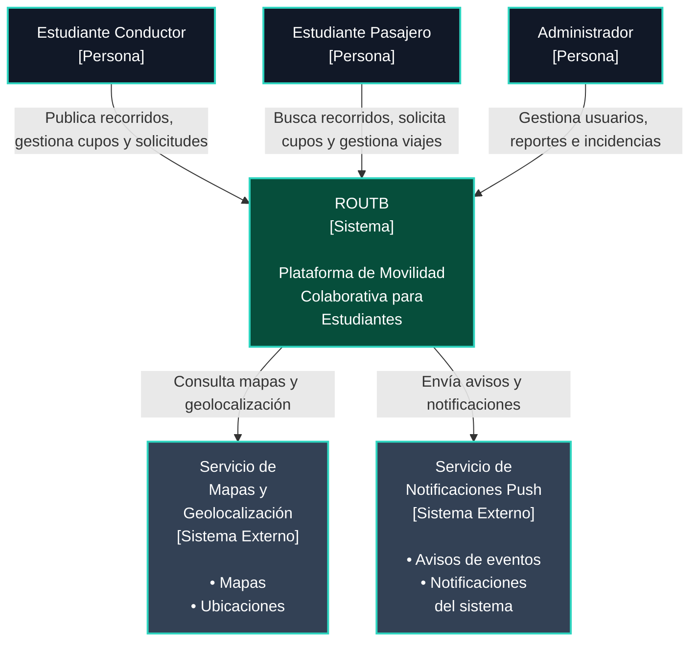
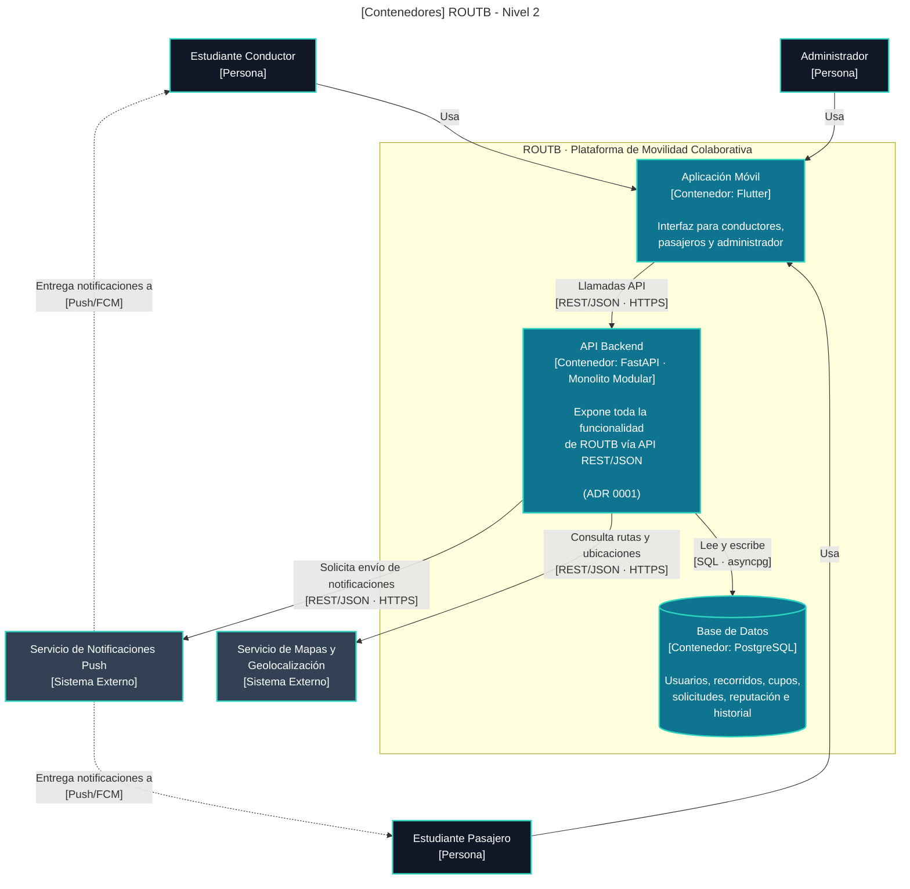

**Nivel 1 — Contexto**

| Elemento | Significado |
|---|---|
| Persona | Actor humano que interactúa con ROUTB |
| Sistema | ROUTB, el sistema en construcción por el equipo |
| Sistema Externo | Servicio de terceros, fuera del repositorio del equipo |

---

**Nivel 2 — Contenedores**

| Elemento | Significado |
|---|---|
| Persona | Actor humano |
| Contenedor | Pieza desplegable de ROUTB (app, API o BD) |
| Sistema Externo | Servicio de terceros, fuera del repositorio del equipo |
