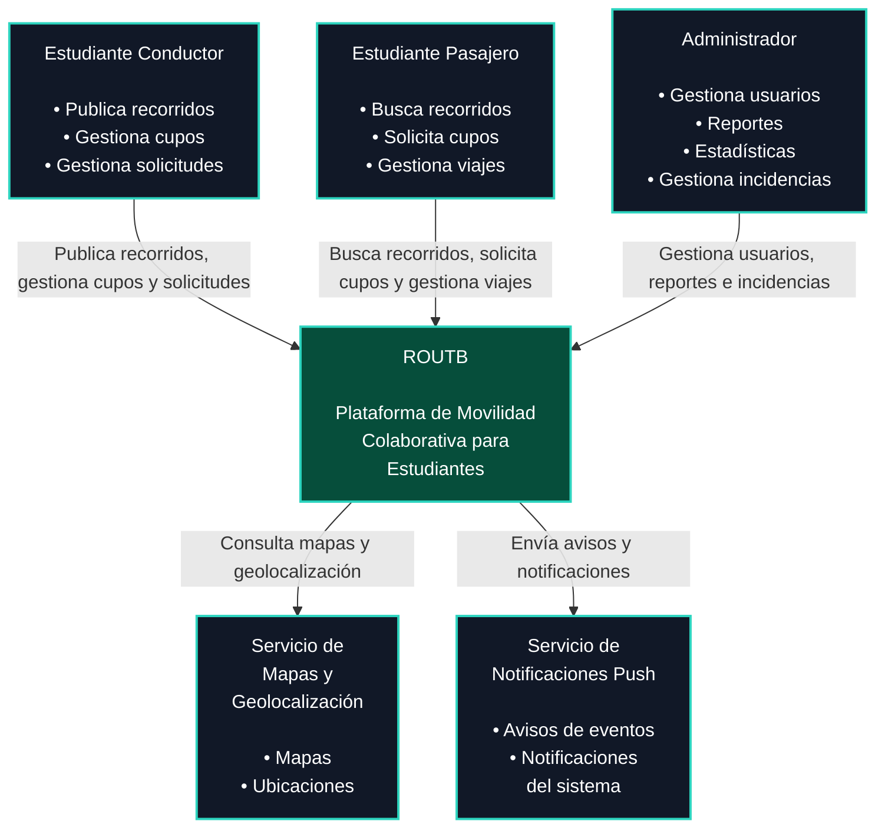

```mermaid
flowchart TD

    EC["Estudiante Conductor<br/><br/>• Publica recorridos<br/>• Gestiona cupos<br/>• Gestiona solicitudes"]

    EP["Estudiante Pasajero<br/><br/>• Busca recorridos<br/>• Solicita cupos<br/>• Gestiona viajes"]

    ADM["Administrador<br/><br/>• Gestiona usuarios<br/>• Reportes<br/>• Estadísticas<br/>• Gestiona incidencias"]

    R["ROUTB<br/><br/>Plataforma de Movilidad<br/>Colaborativa para<br/>Estudiantes"]

    MAP["Servicio de<br/>Mapas y<br/>Geolocalización<br/><br/>• Mapas<br/>• Ubicaciones"]

    PUSH["Servicio de<br/>Notificaciones Push<br/><br/>• Avisos de eventos<br/>• Notificaciones<br/>del sistema"]

    %% Conexiones principales
    EC -->|"Publica recorridos, gestiona cupos y solicitudes"| R
    EP -->|"Busca recorridos, solicita cupos y gestiona viajes"| R
    ADM -->|"Gestiona usuarios, reportes e incidencias"| R

    R -->|"Consulta mapas y geolocalización"| MAP
    R -->|"Envía avisos y notificaciones"| PUSH

    %% Estilos
    classDef actor fill:#111827,stroke:#2dd4bf,color:#fff,stroke-width:2px
    classDef system fill:#064e3b,stroke:#2dd4bf,color:#fff,stroke-width:2px
    classDef service fill:#111827,stroke:#2dd4bf,color:#fff,stroke-width:2px

    class EC,EP,ADM actor
    class R system
    class MAP,PUSH service
```

Leyenda:

| Tipo | Significado |
|---|---|
| Actor | Persona que interactúa con ROUTB |
| System | Sistema central ROUTB |
| Service | Servicio externo integrado |
