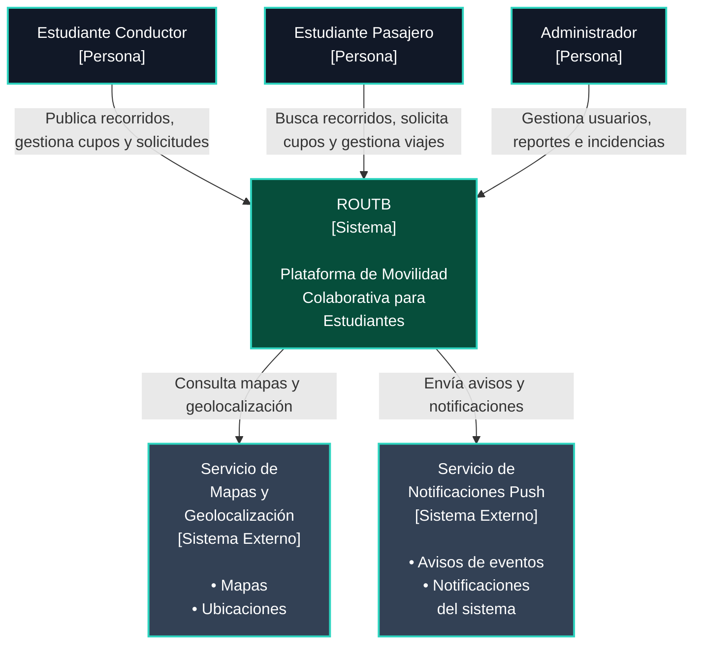
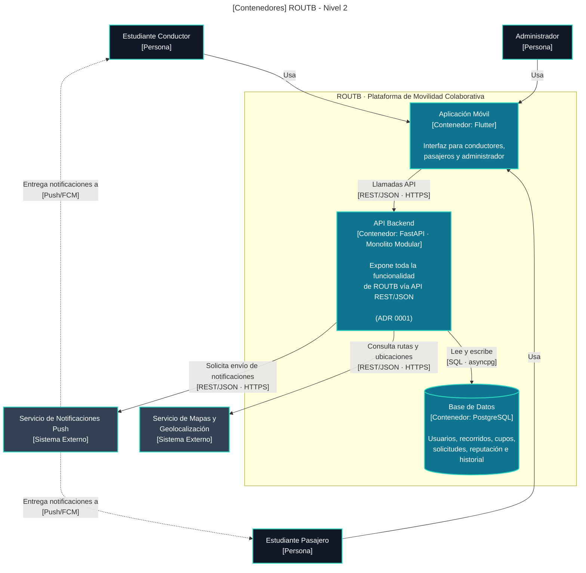

**Nivel 1 — Contexto**

| Elemento | Significado |
|---|---|
| Persona | Actor humano que interactúa con ROUTB |
| Sistema | ROUTB, el sistema en construcción por el equipo |
| Sistema Externo | Servicio de terceros, fuera del repositorio del equipo |

### Impacto de la restricción en el Nivel 1

En el nivel de contexto, la restricción de consistencia de cupos se refleja
como una responsabilidad de ROUTB frente a sus actores. El estudiante
conductor publica un recorrido con una cantidad limitada de cupos y el
estudiante pasajero puede solicitar una reserva, pero el sistema debe
garantizar que dos solicitudes simultáneas no generen una sobreventa. Este
nivel muestra la responsabilidad externa del sistema, mientras que el
mecanismo técnico que la cumple se detalla en el nivel de contenedores.

---

**Nivel 2 — Contenedores**

| Elemento | Significado |
|---|---|
| Persona | Actor humano |
| Contenedor | Pieza desplegable de ROUTB (app, API o BD) |
| Sistema Externo | Servicio de terceros, fuera del repositorio del equipo |

### Impacto de la restricción en el Nivel 2

La restricción se implementa principalmente entre los contenedores **API
Backend** y **Base de Datos**. La aplicación móvil solicita la reserva por
medio de la API; el backend ejecuta una actualización atómica condicionada a
que existan cupos disponibles y la base de datos persiste el resultado. De
esta forma, las solicitudes concurrentes compiten por la misma operación de
actualización y solo se aceptan reservas dentro del límite configurado.

Este nivel se relaciona directamente con el cambio implementado en el módulo
`trips`, sus endpoints de consulta y reserva, y la prueba de concurrencia que
valida 20 intentos sobre 4 cupos.

### Límites conservados tras el cambio

El cambio se mantuvo dentro del límite del contenedor **API Backend** y de la
persistencia de recorridos y cupos en la **Base de Datos**. No se modificaron
los actores del sistema, la aplicación móvil, ni las integraciones externas de
mapas y notificaciones. Tampoco se creó un servicio independiente: el
comportamiento se agregó al módulo `trips` dentro del monolito modular.

La prueba del cambio verifica precisamente este alcance: ejercita los
endpoints y la lógica de reservas del backend, comprueba la actualización de
la disponibilidad y no requiere modificar los límites de los contenedores
definidos en este nivel.
