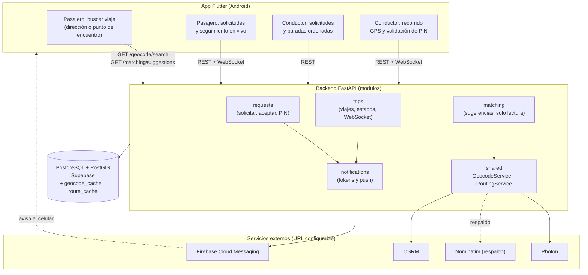
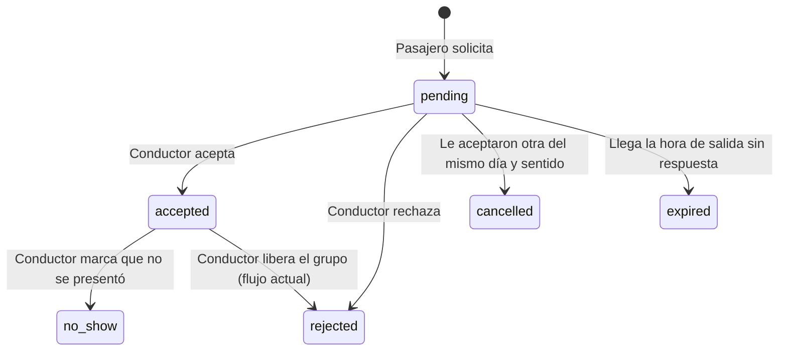
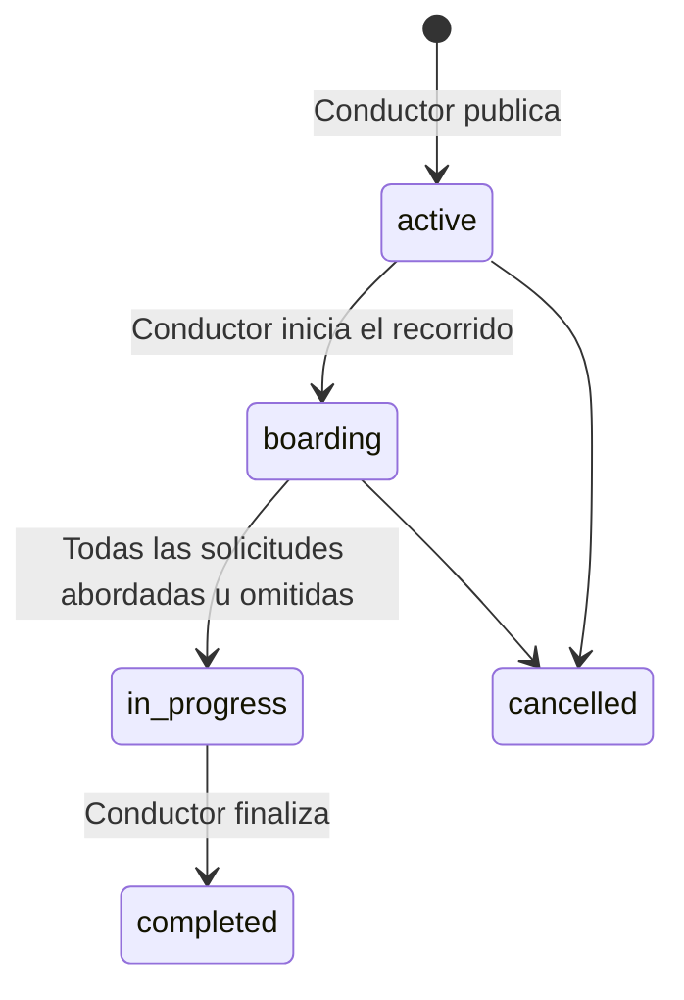

# ROUTB — Plan de Evolución v5.0 (definitivo)
## De "el conductor publica una ruta" a "el pasajero encuentra el viaje que le calza, puerta a puerta"

> **Versión:** 5.0 (vigente)  
> **Fecha:** 7 de octubre de 2026  
> **Alcance de esta versión:** Fases 0 a 3, solo Android, equipo de 2 personas  
> **Regla general:** cada fase es **aditiva**. El código y las pruebas actuales siguen pasando; los viajes y solicitudes existentes siguen funcionando.

---

## 1. Decisiones de diseño clave

Esta versión parte del repositorio real y de las decisiones del equipo. Estas son las decisiones técnicas que más condicionan la implementación; el detalle está en las secciones siguientes.

| Tema | Decisión |
|------|----------|
| Asignación | **El conductor aprueba cada solicitud.** El matching solo **sugiere** viajes; no escribe nada en la base de datos. |
| Alcance | **Fases 0 a 3.** |
| Plataforma | **Solo Android.** iOS queda fuera (no hay Mac). |
| Notificaciones | **Push con FCM** (nuevo ADR 0013). El ADR 0004 había descartado las notificaciones push; el plan lo resuelve como excepción acotada. |
| Sentidos | **Ambos desde el inicio:** origen → UTB y UTB → destino. |
| Cupos | **1 a 4 cupos** por solicitud, igual que la reserva grupal actual (ADR 0007). |
| Parada | **El pasajero elige:** puerta (dirección exacta) o punto de encuentro cercano. En el sentido UTB → destino, **cada persona del grupo elige dónde se baja**. |
| Solicitudes | **Todas las que quiera.** Cuando le aceptan una, se cancelan las demás del mismo día y sentido. |
| Vencimiento | Una solicitud pendiente **vence a la hora de salida del viaje**. |
| Orden de paradas | **Automático por cercanía a lo largo de la ruta** (PostGIS), sin permutaciones. OSRM solo calcula desvío y ETA. |
| PIN | **Vive en `trip_requests`**, un PIN por solicitud (sube todo el grupo). Con el sentido UTB → destino todos suben en el campus, así que atarlo a una parada no funciona. |
| Paradas | **No existe la tabla `trip_stops`.** Las paradas viven en `request_stops`, hija de la solicitud y sin PIN: una fila por parada (una en origen → UTB; de 1 a `seat_count` en UTB → destino). |
| Estados | **Sin migración de enum.** `status` es un `String` sin `CHECK` en el repo; los valores nuevos se añaden en código. |
| Hora de salida | El repo guarda `departure_time` como texto ("7:00 AM"). Se añade `departure_at TIMESTAMPTZ`. |
| Rutas de archivos | Las del repo real (sección 8). |
| Privacidad | Nivel **completo** (consentimiento, retención 30/7 días, purga programada). |

---

## 2. Punto de partida (verificado contra el repositorio)

```
✅ Conductores publican viajes (origen y destino como texto, fecha, hora como texto, cupos, punto de encuentro)
✅ Pasajeros solicitan 1 a 4 cupos; el conductor acepta o rechaza el bloque completo (trip_requests)
✅ Control atómico de cupos (ADR 0003) y reserva grupal (ADR 0007)
✅ Autenticación JWT por teléfono, roles pasajero/conductor, módulo admin
✅ App Flutter con mapa OpenStreetMap (flutter_map), apuntando por defecto a Render
✅ Backend FastAPI en módulos (auth, users, trips, requests, notifications, admin, shared)
✅ Migraciones 001–005 (la 005 elimina la tarifa por cupo)
✅ CI en GitHub Actions con PostgreSQL 16; contrato OpenAPI versionado
⚠️ El módulo `notifications` existe pero está vacío (sin modelo ni rutas)
⚠️ No hay PostGIS, geocodificación, routing, WebSockets ni push
⚠️ `tests/conftest.py` crea las tablas con `Base.metadata.create_all`; las migraciones no se prueban en CI
⚠️ `uvicorn` está sin soporte WebSocket y no hay `pytest-asyncio`
```

---

## 3. Estado objetivo

```
→ El pasajero indica dónde está (dirección exacta o punto de encuentro), cuándo y cuántos cupos necesita; en el sentido UTB → destino, cada persona del grupo indica dónde se baja
→ La app le sugiere viajes compatibles, ordenados por qué tan poco desvían al conductor, con hora estimada de recogida
→ Envía solicitud a los viajes que quiera; el conductor ve la dirección o el barrio y acepta o rechaza
→ Al aceptarle un viaje, se cancelan sus otras solicitudes del mismo día y sentido, y le llega una notificación
→ El conductor ve las paradas ya ordenadas a lo largo de su ruta
→ Con el viaje en curso, el pasajero ve al conductor acercarse en tiempo real (app abierta)
→ PIN de 4 dígitos: el pasajero lo muestra, el conductor lo valida y sube todo el grupo
→ Los datos de ubicación se piden con consentimiento, se ven lo mínimo necesario y se borran solos
```

---

## 4. Decisiones cerradas

| # | Decisión | Fuente |
|---|----------|--------|
| 1 | El conductor aprueba cada solicitud; el matching solo sugiere | Equipo |
| 2 | Alcance hasta la Fase 3 (tiempo real y PIN) | Equipo |
| 3 | Viajes de un día específico (no recurrentes) | Equipo |
| 4 | Dos sentidos: origen → UTB y UTB → destino | Equipo |
| 5 | Solicitud de 1 a 4 cupos | Equipo |
| 6 | Recogida o entrega: puerta o punto de encuentro, a elección del pasajero. En UTB → destino, cada persona de un grupo elige dónde se baja | Equipo |
| 7 | Solicitudes ilimitadas por pasajero; al aceptarle una se cancelan las otras (alcance en la sección 5) | Equipo |
| 8 | Antes de aceptar, el conductor ve solo la dirección o el barrio, sin cálculos | Equipo |
| 9 | Una solicitud pendiente vence a la hora de salida del viaje | Equipo |
| 10 | Sugerencias ordenadas por desvío real calculado con OSRM | Equipo |
| 11 | Orden de las paradas automático, por cercanía a lo largo de la ruta | Equipo |
| 12 | Un PIN por solicitud: al validarlo sube todo el grupo | Equipo |
| 13 | Notificaciones push con FCM | Equipo |
| 14 | Solo Android; iOS fuera de esta versión | Equipo |
| 15 | GPS del conductor solo con la app abierta (límite documentado en el ADR 0014) | Equipo |
| 16 | Privacidad completa: consentimiento, retención y purga programada | Equipo |
| 17 | El extremo UTB es un único punto (campus principal) | Equipo |
| 18 | Hay un proyecto de Supabase de prueba (staging) para ensayar migraciones | Equipo |
| 19 | Dos personas implementan | Equipo |
| 20 | Plan en Markdown dentro de `docs/` | Equipo |
| 21 | Límites de compatibilidad del matching: ver sección 6 | Propuesta de este plan (el equipo delegó la elección) |

---

## 5. Supuestos que debes confirmar

Estas decisiones las propone el plan para completar huecos. Si alguna no te convence, se cambia antes de empezar.

1. **Alcance de la cancelación automática.** Al aceptar una solicitud se cancelan las demás del mismo pasajero **con la misma fecha y el mismo sentido**. Si fuera "todas sin excepción", un pasajero no podría tener viaje el lunes y el martes. Los viajes legados (sin `direction`) quedan fuera de esta regla y se comportan como hoy.
2. **El conductor también recibe push** cuando llega una solicitud nueva (si no, solo se enteraría al abrir la app). Se suma a las push al pasajero.
3. **Antes de aceptar, el conductor no ve coordenadas**, solo la dirección de cada parada (`request_stops.address_text`). Las coordenadas exactas se revelan al aceptar. Cumple la decisión 8 y el acceso mínimo.
4. **Paradas por solicitud.** Origen → UTB: una sola parada de recogida para todo el grupo (sube junto y el PIN es uno por solicitud). UTB → destino: el grupo sube junto en el campus y **cada persona elige dónde se baja**: de 1 a `seat_count` paradas, y varias personas pueden compartir una (`seats` indica cuántas se bajan ahí). Las recogidas separadas por persona en origen → UTB quedan fuera (exigirían un PIN por parada).
5. **Ubicación UTB.** Se define una sola vez en variables de entorno (`UTB_CAMPUS_LAT`, `UTB_CAMPUS_LNG`). Las coordenadas se obtienen del mapa y se registran en el ADR 0012; este plan no las inventa.
6. **Viajes legados** (sin `direction` ni geometría) siguen visibles y solicitables como hoy, pero **no aparecen en las sugerencias**.
7. **Vencimiento sin tarea programada.** Como Render Free se duerme, el vencimiento se aplica al leer o al intentar aceptar, no con un cron.

---

## 6. Parámetros de matching (propuesta)

Valores iniciales pensados para una ciudad con tráfico variable, donde el conductor es otro estudiante y acepta a mano. Todos son variables de entorno.

| Parámetro | Valor | Relajado ("ver más opciones") | Por qué |
|-----------|:----:|:----:|---------|
| `MATCHING_RADIUS_M` | 800 | 1500 | Distancia máxima de cada punto del pasajero a la ruta; unos 10 min a pie. |
| `MATCHING_TIME_WINDOW_MIN` | 15 | 30 | Diferencia máxima entre la hora pedida y la salida del viaje. |
| `MATCHING_MAX_DETOUR_MIN` | 10 | 15 | Tope de desvío para el conductor. Más allá, casi siempre rechaza. |
| `MATCHING_W_DETOUR` · `_W_WAIT` · `_W_APPROACH` | 0.5 · 0.3 · 0.2 | igual | Deben sumar 1.0. El desvío pesa más porque decide si el conductor acepta. |
| `MATCHING_ROUTING_CANDIDATES` | 3 | 3 | Cuántos candidatos pasan por OSRM (límite 1 req/s del servidor público). |
| `MATCHING_MAX_RESULTS` | 5 | 5 | Sugerencias que se muestran. |

El pasajero ve primero resultados con los valores estrictos. Si no hay ninguno, la app ofrece **"Ver más opciones"** (valores relajados). Cada ampliación la decide el usuario.

```
desvío_norm   = min(desvío_min / MATCHING_MAX_DETOUR_MIN, 1)
espera_norm   = min(|eta_recogida − hora_pedida|_min / MATCHING_TIME_WINDOW_MIN, 1)
acercamiento  = min(distancia_a_la_ruta_m / MATCHING_RADIUS_M, 1)
score         = 0.5·desvío_norm + 0.3·espera_norm + 0.2·acercamiento     # menor = mejor
```

- **Desvío:** minutos extra de manejo para el conductor al insertar todas las paradas de la solicitud en su posición natural a lo largo de la ruta (sección 9, paso 3).
- **Sentido UTB → destino:** la recogida es en el campus, así que `eta_recogida` es la hora de salida del viaje.
- **Grupo con varias paradas (UTB → destino):** todas deben quedar a ≤ `MATCHING_RADIUS_M` de la ruta (si una queda fuera, el viaje se descarta); `acercamiento` usa la **más lejana**.
- Los candidatos que superan un tope se **descartan antes** de calcular el score.

---

## 7. Qué NO cambia

| Elemento | Por qué no se toca |
|----------|--------------------|
| Endpoints REST existentes (`/auth`, `/users`, `/trips`, `/requests`) | El contrato se conserva; solo se **añaden** campos opcionales y endpoints. |
| Control atómico de cupos (`test_cupos.py`, ADR 0003) y reserva grupal (ADR 0007) | Siguen siendo el único mecanismo de reserva: los cupos se descuentan **al aceptar**, con `reserve_request_seats`. |
| Autenticación JWT | El WebSocket valida el mismo token. |
| Estructura de módulos y límites entre ellos | Los módulos se hablan por funciones públicas de `application/` (criterio de erosión de la semana 9). |
| Viajes y solicitudes sin coordenadas | Todas las columnas nuevas son `NULL`-ables. |
| Tema y widgets de la app | Solo se añaden pantallas y widgets; se reutilizan `route_map.dart` y `routb_trip_map.dart`. |
| Eliminar la solicitud (`DELETE /requests/{id}`) | Se conserva tal cual. |

---

## 8. Convenciones de ubicación de archivos (las del repo real)

| Artefacto | Ubicación |
|-----------|-----------|
| Routers | `backend/app/modules/<dominio>/infrastructure/router.py` (los WebSocket, en `ws_router.py` del mismo directorio) |
| Casos de uso | `backend/app/modules/<dominio>/application/<caso_de_uso>.py` (un archivo por caso de uso, como hoy) |
| Esquemas y modelos | `.../infrastructure/schemas.py` y `.../infrastructure/models.py` |
| Servicios compartidos (geocodificación, routing, push) | `backend/app/shared/` (geocodificación y routing) y `backend/app/modules/notifications/` (push) |
| Módulo nuevo | `backend/app/modules/matching/` con la misma estructura de capas |
| Configuración | `backend/app/core/config.py` (clase `Settings`) |
| Migraciones | `backend/migrations/versions/` (siguiente número: **006**) |
| ADR | `docs/adr/` (siguiente número libre: **0009**) |
| Frontend | `frontend/lib/core/` y `frontend/lib/features/<feature>/` |

> **Antes de empezar:** ejecutar `tree backend/app -L 4` en la rama `Changes` y confirmar la tabla. Este plan se verificó contra la copia de `master` del 3 de octubre; si `Changes` difiere, se ajustan las rutas, no el diseño.

---

## 9. Arquitectura objetivo



**Principio de comunicación (complementa al ADR 0004):** REST sigue siendo el canal de **comandos y de verdad** (solicitar, aceptar, validar PIN). El WebSocket solo transporta telemetría y eventos del viaje en curso. La push FCM es **solo un aviso**: nunca es la fuente de verdad, y la app siempre resincroniza por REST (`GET /requests/me`) al abrirse o al recibirla.

### Flujo completo

1. **Sugerir (solo lectura).** `GET /matching/suggestions` filtra con SQL y PostGIS, pasa los 3 mejores por OSRM, calcula desvío y ETA, y devuelve hasta 5 viajes. No escribe nada.
2. **Solicitar.** El pasajero envía `POST /requests/trips/{trip_id}` con sus cupos, sus paradas (puerta o punto de encuentro; en UTB → destino, una por persona o por grupo que se baja junto) y la hora deseada. Queda `pending`; el conductor recibe push.
3. **Aceptar.** El conductor acepta con `PATCH /requests/{id}/accept`. En **una sola transacción corta** (sin llamadas HTTP dentro):
   - se bloquea la fila del pasajero (`SELECT … FOR UPDATE`) para que dos conductores no lo acepten a la vez;
   - se verifica que no tenga otra aceptada del mismo día y sentido (409 `passenger_already_assigned`);
   - se reservan los cupos (`reserve_request_seats`, ADR 0003);
   - se cancelan sus otras solicitudes pendientes del mismo día y sentido (`cancelled`);
   - se recalcula `stop_seq` de todas las paradas (`request_stops`) de las solicitudes aceptadas del viaje por posición a lo largo de la ruta (`ST_LineLocatePoint`).
   Después del `commit`, y fuera de la transacción: se actualizan `eta_estimated` de cada parada y la ruta con OSRM (con respaldo) y se envía la push al pasajero.
4. **Vencer.** Una solicitud `pending` con `departure_at` ya pasado se trata como `expired` al leerla o al intentar aceptarla (409 `request_expired`).

---

## 10. Modelo de datos

> Todo es **aditivo y `NULL`-able**. La migración 006 crea todo el esquema espacial; la 007 añade los tokens de push; la 008 añade el estado del viaje en curso y el PIN. Cada una lleva `downgrade()` completo.

### Migración 006 — Fundación espacial (Fase 0)

```sql
-- SET LOCAL search_path TO public, extensions;   (Supabase instala PostGIS en 'extensions')
CREATE EXTENSION IF NOT EXISTS postgis;

ALTER TABLE users ADD COLUMN location_consent_at TIMESTAMPTZ;   -- NULL = sin autorización

ALTER TABLE trips
    ADD COLUMN direction         VARCHAR(12),               -- 'to_campus' | 'from_campus' | NULL (viaje legado)
    ADD COLUMN departure_at      TIMESTAMPTZ,               -- salida real (hora de Bogotá); se rellena al crear y se reconstruye para los viajes antiguos
    ADD COLUMN origin_geom       GEOMETRY(Point, 4326),     -- punto de salida (el campus si direction = 'from_campus')
    ADD COLUMN dest_geom         GEOMETRY(Point, 4326),     -- punto de llegada (el campus si direction = 'to_campus')
    ADD COLUMN route_geom        GEOMETRY(LineString, 4326),
    ADD COLUMN route_distance_m  INTEGER,
    ADD COLUMN route_duration_s  INTEGER,
    ADD COLUMN route_source      VARCHAR(10),               -- 'osrm' | 'fallback' (ruta calculada con el respaldo geodésico)
    ADD CONSTRAINT trips_direction_valid CHECK (direction IS NULL OR direction IN ('to_campus','from_campus'));

ALTER TABLE trip_requests
    ADD COLUMN requested_at      TIMESTAMPTZ;               -- hora a la que el pasajero quiere salir

-- Paradas de una solicitud: una en origen → UTB; de 1 a seat_count en UTB → destino.
CREATE TABLE request_stops (
    id            SERIAL PRIMARY KEY,
    request_id    INTEGER NOT NULL REFERENCES trip_requests(id) ON DELETE CASCADE,
    seats         SMALLINT NOT NULL CHECK (seats BETWEEN 1 AND 4),   -- personas que usan esta parada
    place_type    VARCHAR(14) NOT NULL,                              -- 'door' | 'meeting_point'
    stop_geom     GEOMETRY(Point, 4326) NOT NULL,                    -- punto exacto (recogida o entrega según el sentido)
    address_text  TEXT NOT NULL,                                     -- lo único que ve el conductor antes de aceptar
    stop_seq      SMALLINT,                                          -- orden en la ruta; solo en solicitudes aceptadas
    eta_estimated TIMESTAMPTZ,
    CONSTRAINT request_stop_place_valid CHECK (place_type IN ('door','meeting_point'))
);
CREATE INDEX idx_request_stops_request ON request_stops (request_id);

-- Consultas por radio en METROS (geography); el índice usa la misma expresión que la consulta.
CREATE INDEX idx_trips_route_geog  ON trips USING GIST ((route_geom::geography));
CREATE INDEX idx_trips_departure   ON trips (departure_date, status, direction);
CREATE INDEX idx_requests_passenger_status ON trip_requests (passenger_id, status);

CREATE TABLE geocode_cache (
    query      TEXT PRIMARY KEY,                -- consulta normalizada
    response   JSONB NOT NULL,
    created_at TIMESTAMPTZ NOT NULL DEFAULT NOW()
);
CREATE INDEX idx_geocode_cache_created ON geocode_cache (created_at);

CREATE TABLE route_cache (
    cache_key  TEXT PRIMARY KEY,                -- SHA-256 de (operación, perfil, coordenadas a 5 decimales)
    response   JSONB NOT NULL,
    created_at TIMESTAMPTZ NOT NULL DEFAULT NOW()
);
CREATE INDEX idx_route_cache_created ON route_cache (created_at);
```

**Integridad de las paradas (en código, no en SQL):** la suma de `seats` de las paradas de una solicitud es igual a su `seat_count`; en `to_campus` hay exactamente una parada.

**Relleno de `departure_at`:** la migración convierte `departure_date` + `departure_time` ("7:00 AM") a `TIMESTAMPTZ` en la zona `America/Bogota` con una función Python tolerante: si un texto no se puede interpretar, deja `NULL` y ese viaje queda fuera de las sugerencias. El caso de uso `create_trip` escribe ambos campos desde ahora.

**`purge_location_data()`** (función SQL idempotente, creada en la 006):
- borra las filas de `request_stops` de solicitudes cuyo viaje salió hace más de `RETENTION_TRIP_DAYS` (30);
- anula `origin_geom`, `dest_geom` y `route_geom` de esos viajes, **incluidos los que quedaron sin conductor** (`driver_id` pasó a `NULL` por `ON DELETE SET NULL`);
- borra filas de `geocode_cache` y `route_cache` con más de `RETENTION_CACHE_DAYS` (7);
- borra tokens de `device_tokens` sin uso en 60 días (la tabla se crea en la 007; la función comprueba que exista).

### Migración 007 — Tokens de push (Fase 2)

```sql
CREATE TABLE device_tokens (
    id           SERIAL PRIMARY KEY,
    user_id      INTEGER NOT NULL REFERENCES users(id) ON DELETE CASCADE,
    token        TEXT NOT NULL UNIQUE,
    platform     VARCHAR(10) NOT NULL DEFAULT 'android',
    created_at   TIMESTAMPTZ NOT NULL DEFAULT NOW(),
    last_seen_at TIMESTAMPTZ NOT NULL DEFAULT NOW()
);
CREATE INDEX idx_device_tokens_user ON device_tokens (user_id);
```

### Migración 008 — Viaje en curso y PIN (Fase 3)

```sql
ALTER TABLE trips
    ADD COLUMN started_at   TIMESTAMPTZ,
    ADD COLUMN completed_at TIMESTAMPTZ;

ALTER TABLE trip_requests
    ADD COLUMN pin_hash       VARCHAR(64),      -- HMAC-SHA256 (hex) del PIN vigente; nunca el PIN en claro
    ADD COLUMN pin_attempts   SMALLINT NOT NULL DEFAULT 0,   -- fallos del PIN vigente (máx. 3)
    ADD COLUMN pin_issues     SMALLINT NOT NULL DEFAULT 0,   -- emisiones de PIN (máx. 3)
    ADD COLUMN pin_expires_at TIMESTAMPTZ,      -- emisión + 5 min
    ADD COLUMN boarded_at     TIMESTAMPTZ,      -- el grupo subió
    ADD COLUMN no_show_at     TIMESTAMPTZ;      -- el pasajero no se presentó
```

### Estados

**Solicitud** (`trip_requests.status`; valores nuevos solo en código):



`boarded_at` registra el abordaje sin cambiar el estado. El retiro por el pasajero (`DELETE`) sigue borrando la fila y liberando cupos, como hoy.

**Viaje** (`trips.status`; hoy solo `active` y `cancelled`):



`active` es el estado "abierto" del viaje. Los viajes fuera de `active` dejan de aparecer en `GET /trips/` y en las sugerencias, porque el código ya filtra por `status == "active"`.

### Privacidad de ubicación

| Dato | Dónde vive | Quién lo ve | Retención |
|------|-----------|-------------|-----------|
| Dirección escrita de cada parada | `request_stops.address_text` | El pasajero; el conductor del viaje **desde que la solicitud llega** | 30 días tras la salida; luego se borra la fila |
| Coordenada exacta de cada parada | `request_stops.stop_geom` | El pasajero; el conductor **solo desde que acepta**. Nunca otros pasajeros ni el admin por API | 30 días tras la salida; luego se borra la fila |
| Origen o destino exacto y ruta del conductor | `trips.origin_geom`, `dest_geom`, `route_geom` | El conductor. Los pasajeros solo ven el barrio (`origin`/`destination` en texto) y sus propias paradas | 30 días tras la salida; luego `NULL` |
| Posición GPS en vivo | Memoria del WebSocket | Conductor y pasajeros del viaje (el pasajero solo ve al conductor) | **No se persiste** |
| Consultas de geocodificación y rutas | `geocode_cache`, `route_cache` | Solo el backend, sin vínculo a un usuario | 7 días |
| Datos enviados a Photon, Nominatim y OSRM | Servicios externos | Reciben texto o coordenadas **desde el backend**, sin identificador de usuario | Según cada proveedor |
| Token del dispositivo | `device_tokens` | Solo el backend | Se borra al cerrar sesión o tras 60 días sin uso |
| Autorización de ubicación | `users.location_consent_at` | El usuario y el backend | Mientras exista la cuenta; revocable |

- **Consentimiento previo:** sin `location_consent_at` el backend responde 403 `location_consent_required` al guardar ubicación exacta, pedir sugerencias o solicitar con parada.
- **Revocación:** `DELETE /users/me/location-consent` pone el campo en `NULL`, cancela las solicitudes pendientes del usuario y borra sus paradas almacenadas.
- **Purga programada:** pg_cron en Supabase (diaria, 08:00 UTC = 03:00 Colombia); si no está habilitado, un workflow de GitHub Actions. **Render Free no sirve para esto** porque se duerme. Debe estar activa **antes de recibir datos reales**.
- **Marco legal:** el diseño sigue los principios de la Ley 1581 de 2012 (autorización previa, finalidad, acceso restringido, temporalidad). Es una base técnica, **no una certificación**: la política de tratamiento y, si aplica, el Registro Nacional de Bases de Datos deben validarse con el área responsable de la UTB antes de abrir el piloto a usuarios reales.
- **El módulo `admin` no debe serializar coordenadas.** Hay una prueba que lo verifica.

---

## 11. Contrato de la API (cambios)

| Método y ruta | Fase | Quién | Notas y errores |
|---------------|:----:|-------|-----------------|
| `GET /geocode/search?q=` | 1 | Autenticado | 30 búsquedas/min por usuario. 503 `geocode_unavailable` si fallan Photon y Nominatim. |
| `POST /users/me/location-consent` | 1 | Cualquiera | Registra `location_consent_at`. |
| `DELETE /users/me/location-consent` | 1 | Cualquiera | Revoca: cancela pendientes y borra coordenadas del usuario. |
| `POST /trips/` **(modificado)** | 1 | Conductor | Campos opcionales: `direction`, `driver_point {lat, lng, address_text}`. 403 `location_consent_required`; 422 si el punto cae fuera de `GEOCODE_BBOX`. |
| `GET /matching/suggestions` | 2 | Pasajero | Parámetros: `direction`, `points` (de 1 a 4 pares `lat,lng` separados por `;`: uno por parada del grupo), `date`, `time`, `seat_count`, `relaxed`. Solo lectura. Sin resultados devuelve `200 []`, no 404. |
| `POST /requests/trips/{trip_id}` **(modificado)** | 2 | Pasajero | Cuerpo opcional: `seat_count`, `requested_at`, `stops [{place_type, lat, lng, address_text, seats}]`. Las paradas son obligatorias si el viaje tiene `direction`: en `to_campus` exactamente una (con `seats = seat_count`); en `from_campus`, de 1 a `seat_count`, y la suma de `seats` debe ser igual a `seat_count` (422 `stops_seat_mismatch` si no). |
| `PATCH /requests/{id}/accept` **(modificado)** | 2 | Conductor | Añade 409 `passenger_already_assigned` y 409 `request_expired`. |
| `GET /requests/trips/{trip_id}` **(modificado)** | 2 | Conductor del viaje | **Corrección de seguridad:** hoy cualquier usuario autenticado puede listarlas. Pasa a 403 si no es el conductor. Las solicitudes pendientes no incluyen coordenadas. |
| `GET /requests/me` **(modificado)** | 2 | Pasajero | Incluye los estados nuevos (`cancelled`, `expired`, `no_show`). |
| `POST /notifications/device-token` · `DELETE …` | 2 | Cualquiera | Registra o borra el token FCM del dispositivo. |
| `POST /trips/{id}/start` · `POST /trips/{id}/complete` | 3 | Conductor | Transiciones validadas; 409 si no son válidas. |
| `POST /requests/{id}/pin` | 3 | Pasajero | Devuelve el PIN **una sola vez**. |
| `POST /requests/{id}/board` | 3 | Conductor | Cuerpo `{pin}`. Errores: 400 `pin_invalid` · 410 `pin_expired` · 429 `pin_locked` · 403 · 409. |
| `POST /requests/{id}/no-show` | 3 | Conductor | Marca `no_show_at`. |
| `WS /ws/trips/{trip_id}` | 3 | Conductor y pasajeros del viaje | Se documenta en el ADR 0014 (no entra en OpenAPI). |

Los clientes viejos siguen funcionando: todo campo nuevo es opcional y los estados nuevos solo aparecen en solicitudes creadas con el flujo nuevo, salvo `expired`, que también puede afectar a solicitudes antiguas pendientes de viajes ya vencidos.

---

## 12. Cómo se reparte el trabajo (2 personas)

| | **Persona A — Backend** | **Persona B — Flutter** |
|---|---|---|
| Fase 0 | Migración 006, CI, compose, `conftest`, ADR 0009 | Crear el proyecto de Firebase y probar `geolocator` en un Android real |
| Fase 1 | Geocodificación, routing, consentimiento, `POST /trips/`, ADR 0010 y 0011 | Diálogo de consentimiento, campo de dirección con pin arrastrable, ajuste de "publicar ruta" |
| Fase 2 | Sugerencias, solicitudes y aceptación, vencimiento, push, ADR 0012 y 0013 | Pantalla de sugerencias, solicitud con paradas, estados de "mis solicitudes", cliente FCM |
| Fase 3 | Estados del viaje, PIN, WebSocket, ADR 0014 | Pantalla del conductor, seguimiento del pasajero, cliente WebSocket |

**Método de trabajo (contract-first):** al empezar cada fase, A actualiza el contrato (`scripts/export_openapi.py` → `docs/openapi.json` y `docs/evidencia/CHANGELOG-api.md`) y lo integra primero. B construye contra ese contrato. Trabajo en la rama `Changes`, Conventional Commits y un PR por fase, como indica `AGENTS.md`. Cada persona revisa el PR de la otra.

---

## 13. Fases

### 🟢 Fase 0 — Fundación de datos (1-2 días · Persona A)

**Objetivo:** habilitar PostGIS en desarrollo, CI y Supabase, y crear el esquema sin romper nada.

| Archivo | Acción | Descripción |
|---------|--------|-------------|
| `docker-compose.yml` | **[MODIFY]** | Cambiar `postgres:16-alpine` por una imagen `postgis/postgis` de **PostgreSQL 16** (verificar el tag en Docker Hub y que la versión mayor coincida con `SHOW server_version;` en Supabase). Al cambiar de imagen, recrear el volumen de desarrollo (`docker compose down -v`); es solo data de prueba. |
| `.github/workflows/ci.yml` | **[MODIFY]** | Usar el service container `postgis/postgis` con las mismas credenciales. Añadir antes de `pytest` un paso que ejecute `alembic upgrade head`, `alembic downgrade -1` y `alembic upgrade head`. |
| `backend/tests/conftest.py` | **[MODIFY]** | Hoy usa `Base.metadata.create_all`. Pasar a ejecutar las migraciones sobre la base de pruebas (o, como mínimo, `CREATE EXTENSION IF NOT EXISTS postgis` antes del `create_all`). Así las migraciones quedan probadas en cada ejecución. |
| `backend/migrations/env.py` | **[MODIFY]** | `include_object` que ignore `spatial_ref_sys`, `geometry_columns` y `geography_columns`. |
| `backend/migrations/versions/006_postgis_y_ubicacion.py` | **[NEW]** | Contenido de la sección 10. Lleva `SET LOCAL search_path TO public, extensions`, relleno de `departure_at` y `downgrade()` completo. |
| `backend/app/modules/trips/infrastructure/models.py` y `requests/infrastructure/models.py` | **[MODIFY]** | Columnas nuevas con GeoAlchemy2 y `spatial_index=False` (los índices los crea la migración). El módulo `requests` añade el modelo `RequestStop`. |
| `backend/app/modules/trips/application/create_trip.py` | **[MODIFY]** | Escribir `departure_at` además de `departure_date` y `departure_time`. |
| `backend/app/core/config.py` | **[MODIFY]** | Añadir los parámetros de las secciones 6 y 10 (`UTB_CAMPUS_LAT/LNG`, `GEOCODE_BBOX`, `RETENTION_*`, etc.). |
| `backend/requirements.in` y `requirements.txt` | **[MODIFY]** | Añadir `geoalchemy2` y recompilar con hashes. Actualizar `docs/evidencia/dependencias-necesarias.md`. Verificar que existan ruedas para Python 3.14 con `--only-binary :all:`. |
| `backend/tests/test_postgis_radius.py` | **[NEW]** | `ST_DWithin(a::geography, b::geography, 3000)` verdadero a ~2,9 km y falso a ~3,1 km (garantiza metros y no grados). |
| `backend/tests/test_privacy_retention.py` | **[NEW]** | Filas antiguas → `purge_location_data()` anula coordenadas, borra cachés vencidas y es idempotente. |
| `docs/adr/0009-postgis-datos-geoespaciales.md` | **[NEW]** | Por qué PostGIS, la imagen elegida y el procedimiento en Supabase. |

**Procedimiento en Supabase:** (1) ensayar todo en el **proyecto de staging**; (2) habilitar la extensión (*Dashboard → Extensions* o `CREATE EXTENSION postgis WITH SCHEMA extensions;`); (3) `alembic upgrade head`; (4) `SELECT PostGIS_Version();`; (5) recién entonces producción.

**Criterio de éxito**
- `upgrade → downgrade -1 → upgrade` sin errores en desarrollo, CI y staging.
- `SELECT PostGIS_Version();` responde en los tres entornos.
- `pytest -q` pasa completo, incluido `test_cupos.py`.
- Todas las columnas nuevas son `NULL` para los datos existentes.
- `SELECT purge_location_data();` corre sin errores y es idempotente.

---

### 🟡 Fase 1 — Geocodificación, consentimiento y rutas (4-5 días · A y B en paralelo)

**Objetivo:** pasar de "barrio Centro" a una coordenada exacta que el usuario ajusta, con consentimiento, y que el conductor publique un viaje con dirección, sentido y ruta calculada.

**Backend (A)**

| Archivo | Acción | Descripción |
|---------|--------|-------------|
| `backend/app/shared/geocode/service.py` | **[NEW]** | `GeocodeService`: normaliza la consulta, lee `geocode_cache` (TTL 7 días) y, si no hay, llama a Photon (`PHOTON_BASE_URL`, timeout 3 s, `limit=5`, sesgo a Cartagena). Si Photon falla, usa Nominatim **solo en búsqueda explícita** (máx. 1 req/s, `User-Agent` propio). `INSERT … ON CONFLICT DO UPDATE`. |
| `backend/app/shared/routing/service.py` | **[NEW]** | `RoutingService.route(coords)` con OSRM (`ROUTING_BASE_URL`, servidor público por defecto: máx. 1 req/s con limitador interno, timeout 3 s). Caché en `route_cache` (24 h, coordenadas a 5 decimales). **Respaldo geodésico** (distancia × 1,3 a 25 km/h) marcando `degraded=true`. |
| `backend/app/modules/geocode/infrastructure/router.py` | **[NEW]** | `GET /geocode/search` con límite de 30/min por usuario; usa `GeocodeService`. Se registra en `main.py`. |
| `backend/app/modules/users/infrastructure/router.py` | **[MODIFY]** | `POST` y `DELETE /users/me/location-consent`. |
| `backend/app/modules/trips/application/create_trip.py` | **[MODIFY]** | Con `direction` y `driver_point`: exigir consentimiento, validar `GEOCODE_BBOX`, guardar `origin_geom`/`dest_geom` (el otro extremo es el campus), **commit**, y después —fuera de la transacción— calcular la ruta y guardar `route_geom`, `route_distance_m`, `route_duration_s` y `route_source`. Si OSRM falla, se guarda una línea recta marcada `fallback`. |
| `.github/workflows/purge-location-data.yml` | **[NEW]** | Alternativa a pg_cron: ejecuta `SELECT purge_location_data();` a diario. Se omite si la purga queda en pg_cron. Debe estar activa **antes de recibir datos reales**. |
| `backend/tests/test_geocode.py` | **[NEW]** | Con `httpx.MockTransport`: caché, respaldo a Nominatim, doble fallo, límite de 1 req/s. |
| `backend/tests/test_routing.py` | **[NEW]** | Caché, timeout y respaldo geodésico. |
| `backend/tests/test_trips_flow.py` | **[MODIFY]** | Viaje con `direction` en ambos sentidos; viaje sin coordenadas sigue funcionando. |
| `backend/tests/test_openapi_contract.py` | **[MODIFY]** | Añadir los endpoints y campos nuevos. |
| `docs/adr/0010-…` y `docs/adr/0011-…` | **[NEW]** | 0010: Photon + caché en tabla + uso justo + ruta a un Photon propio. 0011: consentimiento, retención y purga. |

**Frontend (B)**

| Archivo | Acción | Descripción |
|---------|--------|-------------|
| `frontend/lib/core/widgets/address_search_field.dart` | **[NEW]** | Campo de dirección con botón **"Buscar dirección"**, lista de resultados, **pin arrastrable** sobre el mapa existente y botón "Usar mi ubicación" (el permiso se pide al pulsarlo). |
| `frontend/lib/core/widgets/location_consent_dialog.dart` | **[NEW]** | Qué se guarda, quién lo ve, cuánto tiempo y cómo revocarlo. |
| `frontend/lib/features/trips/data/geocode_repository.dart` | **[NEW]** | Cliente de `GET /geocode/search`. |
| `frontend/lib/features/driver/widgets/publish_route_sheet.dart` | **[MODIFY]** | Elegir sentido (a la UTB / desde la UTB) y marcar el punto del conductor con el campo nuevo. |
| `frontend/pubspec.yaml` | **[MODIFY]** | Añadir `geolocator`. |

> **El pin arrastrable no es opcional.** En OSM los números de casa de Cartagena pueden estar incompletos y una dirección "exacta" puede caer en el centro de la calle. El ADR 0010 registra una prueba con **al menos 10 direcciones reales** de Cartagena; si menos de 8 resuelven razonablemente, el ajuste manual del pin pasa a ser el flujo principal.

**Criterio de éxito**
- El conductor escribe una dirección, pulsa *Buscar*, elige, ajusta el pin y publica un viaje en cada sentido; `origin_geom`/`dest_geom` y `route_geom` quedan poblados.
- Búsqueda < 1 s con caché y ≤ 2 s sin caché; nunca más de 1 req/s hacia Nominatim.
- Sin `location_consent_at` el backend responde 403 `location_consent_required`.
- Con Photon y Nominatim caídos, la UI sigue permitiendo "Usar mi ubicación" y el pin manual.
- Con OSRM caído, el viaje se publica con ruta de respaldo.
- `pytest -q` pasa y los viajes sin coordenadas siguen funcionando.

---

### 🔴 Fase 2 — Sugerencias, solicitudes con paradas y push (8-10 días · A y B en paralelo)

**Objetivo:** el pasajero encuentra viajes compatibles, solicita con sus paradas, el conductor aprueba y el pasajero se entera por push.

**Backend (A)**

| Archivo | Acción | Descripción |
|---------|--------|-------------|
| `backend/app/modules/matching/` (`application/suggest_trips.py`, `infrastructure/router.py`, `schemas.py`) | **[NEW]** | `GET /matching/suggestions`. **Solo lectura.** Paso 1 (solo SQL): viajes `active` de la fecha, mismo `direction`, con cupos ≥ `seat_count`, `departure_at` dentro de la ventana, todos los puntos a ≤ `MATCHING_RADIUS_M` de la ruta (`ST_DWithin(…::geography, …)`), conductor distinto del pasajero y sin solicitud previa de este pasajero; se traen 10 por cercanía. Paso 2: los 3 mejores pasan por `RoutingService` (una llamada por candidato, ruta actual con todas las paradas insertadas en su posición natural) para sacar desvío y ETA. Paso 3: se descartan los que superan topes, se calcula el score (sección 6) y se devuelven hasta 5. Marca `degraded` cuando el cálculo usó el respaldo. |
| `backend/app/modules/requests/application/create_request.py` | **[MODIFY]** | Aceptar `requested_at` y `stops`; validar la suma de `seats` y una sola parada en `to_campus` (422). Exigir consentimiento y `GEOCODE_BBOX`. Mantener las validaciones actuales (cupos, conductor distinto, duplicado por viaje). Notificar al conductor. **Sin límite de solicitudes pendientes por pasajero.** |
| `backend/app/modules/requests/application/manage_request.py` | **[MODIFY]** | `accept_request` en una transacción corta: bloqueo de la fila del pasajero, verificación de conflicto, `reserve_request_seats`, cancelación de las otras pendientes del mismo día y sentido, recálculo de `stop_seq` de todas las paradas. Después del `commit`: ETA y ruta con OSRM, y push al pasajero. Ninguna llamada HTTP dentro de la transacción. |
| `backend/app/modules/requests/application/order_stops.py` | **[NEW]** | Orden de paradas por posición a lo largo de la ruta con `ST_LineLocatePoint(route_geom, stop_geom)` (ascendente para `to_campus`; para `from_campus`, desde el campus). Lee la ruta del viaje mediante una función pública de `trips/application/`; **no** escribe tablas de otro módulo. Las paradas de una misma solicitud pueden quedar intercaladas con las de otras. |
| `backend/app/modules/requests/application/expire_requests.py` | **[NEW]** | `expire_stale_requests(db)` idempotente: pasa a `expired` las `pending` cuyo viaje ya salió (o terminó su `departure_date` si no tiene `departure_at`). Se invoca al leer y al aceptar; 409 `request_expired`. |
| `backend/app/modules/requests/application/list_requests.py` y `infrastructure/router.py` | **[MODIFY]** | `GET /requests/trips/{trip_id}` solo para el conductor del viaje (403 si no). Las paradas de solicitudes `pending` omiten `stop_geom`; `address_text` sí se muestra. |
| `backend/app/modules/notifications/` | **[NEW]** | Modelo `DeviceToken`, `POST/DELETE /notifications/device-token`, caso de uso `send_push`, cliente FCM (`infrastructure/fcm_client.py`). El token inválido (`UNREGISTERED`) se borra solo. |
| `backend/migrations/versions/007_device_tokens.py` | **[NEW]** | Tabla `device_tokens` (sección 10). |
| `backend/app/core/config.py` | **[MODIFY]** | `FCM_PROJECT_ID`, `FCM_SERVICE_ACCOUNT_B64` (la credencial vive **solo** en variables de entorno; nunca en el repo). |
| `backend/requirements.in` | **[MODIFY]** | `google-auth` para obtener el token OAuth de la cuenta de servicio; el envío usa `httpx` hacia la API HTTP v1 de FCM. Se prefiere esto a `firebase-admin` por peso y por compatibilidad con Python 3.14 (verificar ruedas). Actualizar `dependencias-necesarias.md`. |
| `backend/tests/test_matching_suggestions.py` | **[NEW]** | Orden por score, topes, "ver más opciones", viajes legados excluidos, ambos sentidos, `seat_count` 1–4, grupo con varios puntos (uno fuera del radio descarta el viaje), sin resultados → `200 []`, sin consentimiento → 403. |
| `backend/tests/test_requests_assignment.py` | **[NEW]** | Aceptar cancela las otras del mismo día y sentido y no toca las de otro día; **dos conductores aceptan a la vez al mismo pasajero → solo una aceptada**; viajes legados sin cambios; el conductor no ve coordenadas antes de aceptar. |
| `backend/tests/test_request_stops.py` | **[NEW]** | Grupo de 4 cupos con 3 paradas distintas en `from_campus` (2+1+1): se crea, se acepta y `stop_seq` sigue el orden de la ruta aunque las paradas del grupo se intercalen con las de otra solicitud; suma de `seats` ≠ `seat_count` → 422; más de una parada en `to_campus` → 422; borrar la solicitud borra sus paradas; `pending` no expone `stop_geom`. |
| `backend/tests/test_request_expiry.py` | **[NEW]** | Vence a la hora de salida; no se puede aceptar una vencida. |
| `backend/tests/test_push.py` | **[NEW]** | Con `httpx.MockTransport`: envío, token inválido borrado, fallo de FCM no rompe el flujo REST. |
| `backend/tests/test_openapi_contract.py` | **[MODIFY]** | Contrato actualizado. |
| `docs/adr/0012-…` y `docs/adr/0013-…` | **[NEW]** | 0012: sugerencias de solo lectura, score, OSRM con caché y respaldo, orden por posición en la ruta, aprobación del conductor. 0013: FCM como aviso que **complementa** al ADR 0004 (la aprobación humana es asíncrona por naturaleza; REST sigue siendo la verdad y el cliente resincroniza). |

**Frontend (B)**

| Archivo | Acción | Descripción |
|---------|--------|-------------|
| `frontend/lib/features/matching/` (`data/matching_repository.dart`, `presentation/suggestions_screen.dart`) | **[NEW]** | "¿Dónde estás? → ¿Cuándo? → ¿Cuántos cupos?" y lista de sugerencias con hora estimada de recogida. En UTB → destino con más de un cupo, el paso "¿dónde?" pide una parada por persona (o "se bajan juntos"). Estado vacío con **"Ver más opciones"**. Atribución *"Datos © OpenStreetMap"*. |
| `frontend/lib/features/passenger/…` | **[MODIFY]** | Elegir puerta o punto de encuentro (en UTB → destino, uno por persona o por grupo que se baja junto), enviar la solicitud con `stops`, y mostrar los estados nuevos (cancelada porque te aceptaron otra, vencida). |
| `frontend/lib/features/driver/widgets/driver_cards.dart` | **[MODIFY]** | La tarjeta de solicitud muestra nombre, cupos y la dirección o barrio de **cada parada** (con cuántas personas se bajan ahí); sin cálculos. |
| `frontend/lib/core/push/push_service.dart` | **[NEW]** | `firebase_messaging` + `flutter_local_notifications`: pedir el permiso de notificaciones (Android 13+), registrar el token al iniciar sesión, borrarlo al cerrar sesión, y refrescar `GET /requests/me` al recibir o abrir una push. |
| `frontend/pubspec.yaml` y `android/` | **[MODIFY]** | `firebase_core`, `firebase_messaging`, `flutter_local_notifications`; plugin de Google Services. `google-services.json` **no se sube al repo** (va en `.gitignore`; se comparte en privado). |

**Criterio de éxito**
- El pasajero obtiene sugerencias en ≤ 4 s (p95, incluso con caché frío o en respaldo).
- Con 3 viajes cercanos, el orden sigue el score y el de menor desvío aparece primero.
- Una solicitud con 3 cupos aceptada deja 3 cupos menos; al aceptar otra del mismo pasajero y día, las demás quedan `cancelled`.
- Dos conductores aceptando a la vez: una sola aceptación.
- El conductor ve dirección o barrio antes de aceptar y coordenadas solo después.
- Un grupo de 4 cupos en UTB → destino con 3 paradas distintas se solicita y se acepta; el conductor ve las 3 paradas ordenadas a lo largo de la ruta.
- El pasajero recibe la push de aceptación con la app cerrada, y la lista se actualiza al abrirla.
- Con OSRM o FCM caídos, el flujo REST completa igualmente.
- `pytest -q` pasa y `test_cupos.py` sigue pasando.

---

### 🔵 Fase 3 — Viaje en curso: tiempo real y PIN (6-7 días · A y B en paralelo)

**Objetivo:** el conductor sigue sus paradas ordenadas, el pasajero ve al conductor acercarse y el PIN valida el abordaje del grupo.

> [!IMPORTANT]
> **Compuerta antes de empezar (hosting).** El WebSocket y la demo en vivo exigen un servicio que no se duerma y **una sola instancia** (el manager es en memoria). En Render Free el servicio se duerme tras 15 minutos sin tráfico y el arranque en frío medido fue de ~65 s. Hay que decidir antes: (a) Render Free con monitor externo a `/health` en horario de uso; (b) instancia de pago durante el piloto; (c) demo solo local o en clase. Hasta entonces la Fase 3 puede construirse y probarse en local.
>
> Esta fase requiere el **ADR 0014**, que **complementa** al 0004: REST para comandos; WebSocket solo para telemetría y eventos; solo con la app en primer plano; una sola instancia; salida futura a Redis Pub/Sub.

**Reglas del WebSocket**
- **Autenticación por primer mensaje:** `wss://…/ws/trips/{trip_id}` y, en 5 s, `{"type":"auth","token":"<JWT>"}`; si no llega, cierre 4401. El token no va en la URL (queda en logs).
- **Autorización:** solo el conductor del viaje y los pasajeros con solicitud `accepted`. Los mensajes se filtran por rol: el pasajero ve la posición del conductor y su propio ETA, nunca datos de otros pasajeros.
- **GPS:** el conductor envía su posición cada 5 s **solo con la app abierta**; el servidor ignora `gps_update` de otros roles y **no persiste** posiciones.
- **ETA dinámico:** se recalcula en el servidor cada 30 s y al llegar a cada parada con distancia geodésica × 1,3 a 25 km/h, sin llamar a OSRM.
- **Heartbeat y reconexión:** `ping` cada 25 s; reconexión del cliente con espera creciente (1, 2, 4, 8 s, tope 30 s, con *jitter*) y **resincronización por REST**, porque el WebSocket no reenvía lo perdido.

**Flujo del PIN (un PIN por solicitud)**
1. Con el viaje en `boarding`, el pasajero pulsa **"Mostrar mi PIN"** → `POST /requests/{id}/pin`. El servidor genera 4 dígitos con `secrets`, guarda `pin_hash`, `pin_expires_at = ahora + 5 min`, `pin_attempts = 0`, suma una emisión (máx. 3) y lo devuelve **una sola vez**, únicamente al pasajero titular.
2. El pasajero sube con su grupo y le dice el PIN al conductor.
3. El conductor lo ingresa → `POST /requests/{id}/board`. El servidor comprueba que sea el conductor, que la solicitud esté `accepted` y sin abordar, que el PIN esté vigente y `pin_attempts < 3`, y compara con `hmac.compare_digest`.
4. **Éxito:** `boarded_at = ahora`, se limpia `pin_hash` y se emite `passenger_boarded` ("SUBIÓ [NOMBRE] +2" y vibración). **Fallo:** `pin_attempts + 1`; con 3 fallos queda bloqueado hasta que el pasajero emita un PIN nuevo.
5. Si el pasajero no se presenta, el conductor usa `POST /requests/{id}/no-show`. El viaje pasa a `in_progress` cuando todas las solicitudes aceptadas están abordadas u omitidas.
6. **Sentido UTB → destino:** todos suben en el campus, así que el PIN se valida allí; las paradas posteriores son entregas y no llevan PIN.

> Con 4 dígitos, 3 intentos por emisión y 3 emisiones, un atacante dispone como máximo de 9 intentos sobre 10 000 combinaciones (0,09 %). El hash incluye `request_id` y `trip_id`; `PIN_HMAC_SECRET` vive solo en variables de entorno.

**Backend (A)**

| Archivo | Acción | Descripción |
|---------|--------|-------------|
| `backend/migrations/versions/008_estado_viaje_y_pin.py` | **[NEW]** | Columnas de la sección 10. |
| `backend/app/modules/trips/application/start_trip.py` y `complete_trip.py` | **[NEW]** | Transiciones validadas (409 si no son válidas). Al iniciar, notifica por push a los pasajeros aceptados ("tu conductor salió"). |
| `backend/app/modules/requests/application/pin.py` | **[NEW]** | `generate_pin`, `hash_pin`, `verify_pin` con `hmac.compare_digest`. |
| `backend/app/modules/requests/application/board_request.py` y `no_show_request.py` | **[NEW]** | Abordaje y omisión; el paso a `in_progress` se decide mediante una función pública de `trips/application/`. |
| `backend/app/modules/trips/application/ws_manager.py` | **[NEW]** | `ConnectionManager`: grupos por `trip_id`, `send_to_role`, `broadcast`, heartbeat y última posición del conductor **en memoria**. |
| `backend/app/modules/trips/infrastructure/ws_router.py` | **[NEW]** | Endpoint `/ws/trips/{trip_id}` con las reglas anteriores. Eventos: `auth`, `gps_update`, `eta_update`, `stop_arrived`, `passenger_boarded`, `trip_status`. |
| `backend/requirements.in` | **[MODIFY]** | `uvicorn[standard]` (o `websockets`) y `pytest-asyncio`, con hashes. Actualizar `dependencias-necesarias.md`. |
| `backend/tests/test_websocket.py` | **[NEW]** | Sin token → 4401; usuario ajeno → cierre; `gps_update` de un pasajero → ignorado; mensajes filtrados por rol; nada se escribe en la base de datos. |
| `backend/tests/test_pin.py` | **[NEW]** | Éxito de un grupo de 3 cupos; 3 fallos → 429; expiración → 410; solo el titular emite; máx. 3 emisiones; la BD no contiene el PIN en claro. |
| `backend/tests/test_trip_states.py` | **[NEW]** | Transiciones válidas e inválidas de `active → boarding → in_progress → completed` y `cancelled`. |
| `docs/adr/0014-websockets-telemetria-viajes.md` | **[NEW]** | Excepción acotada al ADR 0004. |

**Frontend (B)**

| Archivo | Acción | Descripción |
|---------|--------|-------------|
| `frontend/lib/core/network/websocket_service.dart` | **[NEW]** | `web_socket_channel`: autenticación por primer mensaje, `Stream` de eventos, reconexión con *jitter* y resincronización por REST. |
| `frontend/lib/features/trip_live/presentation/driver_trip_screen.dart` | **[NEW]** | Paradas **ordenadas**, botón "Llegué", campo de PIN, "No se presentó". Reutiliza `routb_trip_map.dart`. Mantiene la pantalla encendida (`wakelock_plus`), envía GPS con `geolocator` y avisa si la app pasa a segundo plano. |
| `frontend/lib/features/trip_live/presentation/passenger_tracking_screen.dart` | **[NEW]** | Mapa con la posición del conductor, ETA y "Mostrar mi PIN" con cuenta regresiva de 5 min. |
| `frontend/pubspec.yaml` | **[MODIFY]** | `web_socket_channel`, `wakelock_plus`. |

**Criterio de éxito**
- El conductor mueve su posición y el pasajero ve el marcador actualizado en ≤ 1 s.
- El pasajero ve su PIN; el conductor ingresa el correcto y recibe vibración y "SUBIÓ [NOMBRE] +N". Tres PIN erróneos bloquean; uno de más de 5 min responde 410.
- Si la conexión cae, el cliente reconecta (1, 2, 4, 8 s) y resincroniza por REST.
- Con la app en segundo plano el conductor ve un aviso y el cliente deja de enviar GPS (límite documentado en el ADR 0014).
- Ninguna posición GPS se escribe en la base de datos.
- Los dos sentidos funcionan de punta a punta, con un grupo de 3 cupos; en UTB → destino, el grupo se baja en 3 lugares distintos y el conductor los recorre en orden.
- `pytest -q` y `test_openapi_contract.py` pasan.

---

## 14. ADR por crear

| ADR | Fase | Decisión |
|-----|:----:|----------|
| **0009** | 0 | PostGIS: consultas en metros, imagen y procedimiento en Supabase. |
| **0010** | 1 | Geocodificación con Photon + caché en tabla; Nominatim solo de respaldo; sin Redis. |
| **0011** | 1 | Privacidad de ubicación: consentimiento, acceso mínimo, retención y purga programada. |
| **0012** | 2 | Sugerencias de solo lectura, score, OSRM con caché y respaldo, orden de paradas por posición en la ruta, aprobación del conductor. |
| **0013** | 2 | Push FCM como aviso que complementa al ADR 0004. |
| **0014** | antes de 3 | WebSocket para telemetría de viajes en curso; complementa al ADR 0004. |

> Se numeran en el orden en que se crean, que es el de las fases: 0009 → 0010 → 0011 → 0012 → 0013 → 0014.

---

## 15. Compuertas y decisiones pendientes

| Compuerta | Cuándo | Qué hay que resolver |
|-----------|--------|----------------------|
| **G0** | Antes de la Fase 0 | Confirmar los supuestos de la sección 5; tener `master`/`Changes` con CI en verde; `tree backend/app -L 4` en `Changes`; anotar las coordenadas del campus UTB; crear el proyecto de Firebase; confirmar la versión de PostgreSQL de Supabase. |
| **G1** | Antes de la Fase 3 | Decidir el hosting del piloto (Render Free con monitor, pago, o solo local/clase). |
| **G2** | Antes de usuarios reales | Validar con el área responsable de la UTB la política de tratamiento de datos y la autorización de ubicación; purga programada activa y verificada. |

---

## 16. Riesgos y mitigaciones

| Riesgo | Prob. | Impacto | Mitigación |
|--------|:----:|:----:|-----------|
| PostGIS falla en Supabase (esquema `extensions`, `search_path`) | Media | Alto | Ensayo en el proyecto de staging; `SET LOCAL search_path`; procedimiento en el ADR 0009. |
| El ADR 0004 descartó las push y el equipo las adopta | Alta | Medio | ADR 0013 las justifica como aviso complementario; REST sigue siendo la verdad y el cliente resincroniza. |
| Dos conductores aceptan a la vez al mismo pasajero | Media | Alto | Bloqueo de la fila del pasajero dentro de la transacción de aceptación y prueba de concurrencia. |
| OSRM público (1 req/s, sin garantías) | Media | Medio | Solo 3 candidatos con routing, caché de 24 h, limitador interno, respaldo geodésico y `ROUTING_BASE_URL` para migrar a un OSRM propio. |
| Un grupo con paradas muy dispersas dispara el desvío | Media | Medio | El desvío se calcula con todas las paradas; el radio por punto y el tope `MATCHING_MAX_DETOUR_MIN` filtran antes; el conductor ve todas las direcciones antes de aceptar. |
| Photon público (uso justo, sin SLA) | Media | Medio | Búsqueda por botón, caché de 7 días, límite por usuario, respaldo a Nominatim, `PHOTON_BASE_URL` configurable. |
| Direcciones incompletas en OSM | Alta | Alto | Pin arrastrable, "Usar mi ubicación", prueba con ≥ 10 direcciones reales. |
| Render Free se duerme (arranque en frío ~65 s) y corta WebSockets | Alta | Medio | Compuerta G1; heartbeat y reconexión con resincronización por REST; límite de una instancia en el ADR 0014. |
| Las migraciones no se prueban en CI (`create_all`) | Alta | Alto | `conftest` y CI pasan a ejecutar Alembic (Fase 0). |
| `google-auth`, `geoalchemy2` o `websockets` sin ruedas para Python 3.14 (`--only-binary`) | Media | Medio | Verificar en un entorno limpio antes de comprometer la dependencia; documentar en `dependencias-necesarias.md`. |
| Credenciales de Firebase filtradas | Baja | Alto | Solo en variables de entorno y secrets de CI; `google-services.json` en `.gitignore`; repetir el barrido de credenciales. |
| Fuga de coordenadas por `GET /requests/trips/{trip_id}` o por `admin` | Media | Alto | Restringir al conductor del viaje, ocultar coordenadas en pendientes y probarlo. |
| Pushes que no llegan (ahorro de batería, permiso denegado) | Alta | Bajo | La push es un aviso; la app resincroniza por REST al abrirse. |
| GPS inexacto o nulo en segundo plano | Alta | Medio | Solo primer plano, `wakelock_plus` y aviso al conductor. |
| Solo dos personas: una ausencia frena una fase | Media | Medio | Contract-first y PR cruzados para que ambas conozcan todo el código nuevo. |
| `test_cupos.py` roto por una migración | Baja | Alto | Migraciones aditivas y `NULL`-ables; el flujo de cupos no se modifica. |

---

## 17. Verificación global (antes de dar cada fase por terminada)

1. `pytest -q` pasa completo, incluidos `test_cupos.py`, `test_openapi_contract.py` y las pruebas de la fase.
2. `alembic upgrade head`, `alembic downgrade -1` y `alembic upgrade head` sin errores en desarrollo, CI y staging.
3. `docker compose up --build` levanta PostGIS y la API.
4. `flutter analyze` sin errores ni advertencias, y `dart format --output=none --set-exit-if-changed lib test` sin cambios.
5. `flutter build apk` compila; prueba manual en un Android real.
6. `git diff` sin secretos (`PIN_HMAC_SECRET`, `FCM_SERVICE_ACCOUNT_B64`, `google-services.json`) ni cambios ajenos a la tarea.
7. Documentación al día: `docs/openapi.json` y `CHANGELOG-api.md`, el ADR de la fase, `docs/aspectos.md`, `docs/ia.md` (qué se aceptó, corrigió y rechazó de la IA), secciones de arc42 afectadas (5, 6, 7, 8 y 9) y los diagramas C4.
8. Dependencias nuevas registradas en `docs/evidencia/dependencias-necesarias.md`.
9. Revisión de privacidad: si la fase añade un dato de ubicación, tiene dueño, acceso mínimo y retención definida.

---

## 18. Estimación

| Fase | Qué gana el usuario | Días-persona |
|------|---------------------|:-----------:|
| 0 – PostGIS | Nada visible; cimientos del mapa y de la privacidad. | 1-2 |
| 1 – Geocodificación, consentimiento y rutas | Escribe su dirección o ajusta el pin; el conductor publica con sentido y ruta. | 4-5 |
| 2 – Sugerencias, solicitudes y push | Encuentra viajes compatibles, solicita con sus paradas y recibe aviso al aceptarle. | 8-10 |
| 3 – Tiempo real y PIN | Ve al conductor acercarse y valida el abordaje con PIN. | 6-7 |
| **Total** | | **19-24** |

Con dos personas trabajando en paralelo, son aproximadamente **12 a 15 días laborables**, más ~15 % de margen para integración y revisión. Es una estimación: la Fase 2 es la que más puede moverse (push, concurrencia y OSRM).

---

## 19. Fuera de alcance de esta versión

iOS · recogidas separadas por persona en origen → UTB (exigirían un PIN por parada) · viajes recurrentes · GPS en segundo plano · asignación automática sin aprobación del conductor · optimización de la ruta por permutaciones · pagos o tarifas · Redis · notificaciones push en iOS.

---

## 20. Próximos pasos

1. Revisar la sección 5 y confirmar o ajustar los siete supuestos.
2. Cerrar la compuerta **G0**.
3. Crear el ADR 0009, la migración 006 y los cambios de compose, CI y `conftest` (Fase 0), ensayando primero en staging.
4. Avanzar fase por fase en el orden 0 → 1 → 2 → 3, con la compuerta **G1** antes de la Fase 3 y la **G2** antes de abrir el piloto.

> [!NOTE]
> Este documento está pensado para ser revisado y aprobado antes de cambiar código o infraestructura.
